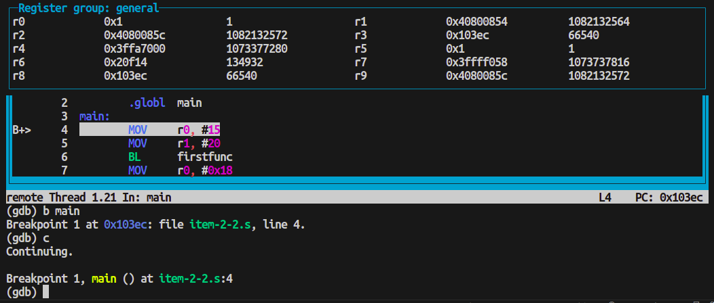

# labproc

## Instalação

Após clonar o repositório, existem algumas opções para simular e depurar os códigos em assembly da disciplina, descritas a seguir

## Opção 1: Utilizando arm-utils com Docker

Para utilizar as ferramentas imediatamente basta rodar o script `run-container.sh` da seguinte forma:

```
~/projects/labproc$ sh ./run_container.sh
```

Isso buscará uma imagem com o pacote arm-utils já instalado e rodará o container.

A saída será algo como:

```
Unable to find image 'brunomariz/labproc:latest' locally
latest: Pulling from brunomariz/labproc
Status: Downloaded newer image for brunomariz/labproc:latest
root@bdab2dc0469e:~/src#
```

### Testando o container

Você pode testar a ferramenta compilando o código do item 2.2 com o seguinte comando:

```
~/src# arm build item-2-2.s
~/src# arm debug a.out
```

Ao rodar esses comandos, deveria ser exibida a tela de depuração do GDB.

Após rodar os comandos <span style='font-family: Courier New, Courier'>b main</span> e <span style='font-family: Courier New, Courier'>c</span> (continue), deveria ser observada a tela a seguir:



## Opção 2: Utilizando arm-utils diretamente

O pacote arm-utils foi desenvolvido pelo professor do lab para ajudar nas experiências. Para instalá-lo, basta rodar os comandos:

```
~/projects/labproc$ cd docker
~/projects/labproc/docker$ sudo apt install ./arm-utils_1.0.2_all.deb
```

## Opção 3: Utilizando Docker (forma antiga)

Utilizar pasta src para realização das experiências. **Não modificar arquivos dentro da pasta gcc-arm.**

## Setup

##### Buscar arquivos do submodulo

```
~/projects/labproc$ git submodule init
~/projects/labproc$ git submodule update
```

##### Criar imagem utilizando script do submodulo

```
~/projects/labproc$ cd gcc-arm/
~/projects/labproc/gcc-arm$ sh ./build_docker.sh
~/projects/labproc/gcc-arm$ cd ..
~/projects/labproc$
```

##### Rodar container

Tenho preferência por utilizar meu proprio comando para o docker run, pois inclui volumes compartilhados entre a pasta `src/` do repositório, não a do submodulo.

```
~/projects/labproc$ docker run --rm -ti -v $PWD/src:/home/student/src epiceric/gcc-arm
student:~/src$
```

Para sair do container, basta usar o comando `Ctrl+D`.
