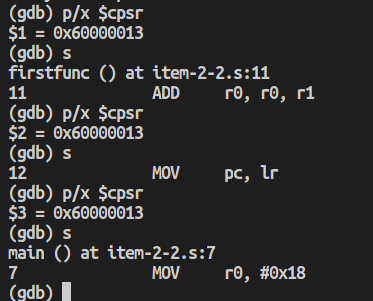
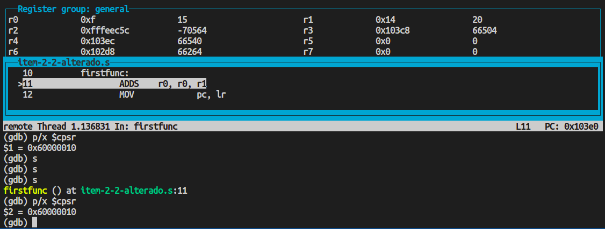
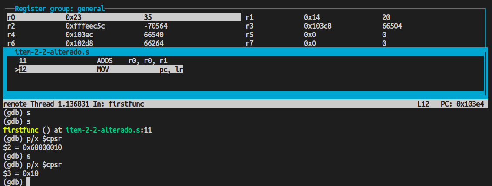

# PCS3432 - Laboratório de Processadores

##### Planejamento - E2

Bruno Mariz - 11261826

---

## Execução do item-2-2.s

#### Antes de alterar o ADD (utilizando docker)

```bash
(gdb) target sim
Connected to the simulator.
(gdb) load
(gdb) b main
Breakpoint 1 at 0x8218: file item-2-2.s, line 4.
(gdb) r
Starting program: /home/student/src/e2/planejamento/a.out

Breakpoint 1, main () at item-2-2.s:4
4               MOV     r0, #15
Current language:  auto; currently asm
(gdb) p/x $cpsr
$1 = 0x60000013
(gdb) s
firstfunc () at item-2-2.s:11
11              ADD     r0, r0, r1
(gdb) p/x $cpsr
$2 = 0x60000013
(gdb) s
12              MOV     pc, lr
(gdb) p/x $cpsr
$3 = 0x60000013
(gdb) s
main () at item-2-2.s:7
7               MOV     r0, #0x18
```



#### Após alterar ADD para ADDS (utilizando arm utils)

```bash
(gdb) b main
(gdb) c
(gdb) p/x $cpsr
$1 = 0x60000010
(gdb) s
(gdb) s
(gdb) s
firstfunc () at item-2-2-alterado.s:11
(gdb) p/x $cpsr
$1 = 0x60000010
```



<p align = "center">printscreen1: antes de rodar a instrução ADDS</p>
<p align = "center"><code>$cpsr = 0x60000010</code></p>
<p align = "center"><code>NZCV = 0110</code></p>

```bash
(gdb) s
(gdb) p/x $cpsr
$3 = 0x10
```



<p align = "center">printscreen2: depois de rodar a instrução ADDS</p>
<p align = "center"><code>$cpsr = 0x10</code></p>

Resultado do CPSR após ADDS:

<p align = "center"><code>NZCV = 0000</code></p>
Isso pode ser explicado pois a soma 15+15 = 30 ($r2 = 0x14) resultou em um número positivo, não nulo, sem carry e sem overflow.
