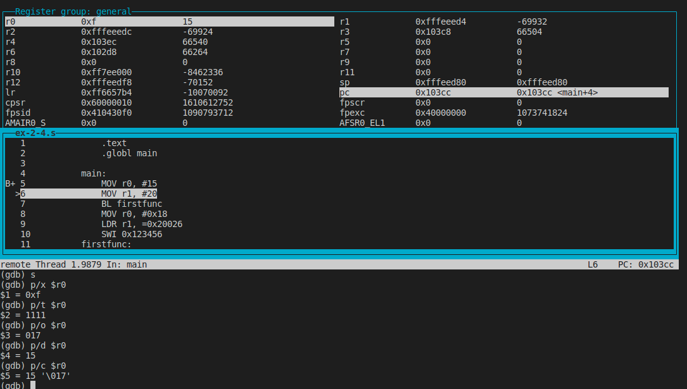

# PCS3432 - Laboratório de Processadores

##### Relatório - E2

| Bancada B8      |          |
| --------------- | -------- |
| Bruno Mariz     | 11261826 |
| Roberta Andrade | 11260832 |

---

### 2.4 Exercises

These exercises give you a chance to compile, step through, and examine code.

Para o exercício 2.4, utilizamos o código abaixo:

```assembly
    .text
    .globl main

main:
    MOV r0, #15
    MOV r1, #20
    BL firstfunc
    MOV r0, #0x18
    LDR r1, =0x20026
    SWI 0x123456
firstfunc:
    ADD r0, r0, r1
    MOV pc, lr
    .end
```

### 2.4.1 Compiling, making, debugging, and running

#### Copy the code from Building a program on page 2-3 into CodeWarrior. There are separate functions in CodeWarrior to compile, make, debug and run a program. Experiment with all four and describe what each does.

```bash
$ arm build -o a.out ex-2-4.s
$ arm debug a.out
```


### 2.4.2 Stepping and stepping in

#### Debug the code from Building a program on page 2-3. Instead of running the code, step all the way through the code using both the step method and the step in method. What is the difference between the two methods of stepping through the assembly code?

Quando a função step in (executada com s ou step) encontra uma chamada de função, ela entra nela e permite a execução de cada uma de suas instruções individualmente, como pode ser observado no print abaixo:


Já a função step, (executada com n ou next) quando encontra uma função, executa todas suas instruções ininterruptamente, e exibe a instrução seguinte, como observado no print abaixo:


### 2.4.3 Data formats

#### Sometimes it is very useful to view registers in different formats to check results more efficiently. Run the code from Building a program on page 2-3. Upon completion, view the different formats of r0 and record your results. Specifically, view the data in hexadecimal, decimal, octal, binary, and ASCII.

Como solicitado no enunciado, foram executados os comandos p/x \$r0, que exibe o valor hexadecimal, p/t \$r0, que exibe o valor binario de r0,p/o \$r0, que exibe o valor octal de r0,p/d \$r0, que exibe o valor decimal de r0, p/c \$r0, que exibe o valor em ASCII de r0.



### 3.10.1 Signed and unsigned addition

#### For the following values of A and B, predict the values of the N, Z, V and C flags produced by performing the operation A + B. Load these values into two ARM registers and modify the program created in Building a program on page 2-3 to perform an addition of the two registers. Using the debugger, record the flags after each addition and compare those results with your predictions. When the data values are signed numbers, what do the flags mean? Does their meaning change when the data values are unsigned numbers?

|               |              |              |     |
| ------------- | ------------ | ------------ | --- |
| 0xFFFF0000    | 0xFFFFFFFF   | 0x67654321   | (A) |
| \+ 0x87654321 | + 0x12345678 | + 0x23110000 | (B) |

```asm
    .text
    .globl main

main:
    LDR r0, =0xFFFF0000
    LDR r1, =0x87654321
    BL firstfunc

    LDR r0, =0xFFFFFFFF
    LDR r1, =0x12345678
    BL firstfunc

    LDR r0, =0x67654321
    LDR r1, =0x23110000
    BL firstfunc

    MOV r0, #0x18
    LDR r1, =0x20026
    SWI 0x123456
firstfunc:
    ADDS r0, r0, r1
    MOV pc, lr
    .end
```

O código acima foi executado com o debugger, e o estado do cpsr foi registrado nas etapas a seguir:

Antes da primeira soma, o cpsr continha um valor aleatório.


```
(gdb) p/x $cpsr
$1 = 0x60000010
```

Após a primeira soma, o cpsr continha o valor 1010.
|N|Z|C|V|
|-|-|-|-|
|1|0|1|0|
A partir dessas flags, podemos averiguar que o resultado foi negativo, não foi nulo, a operação produziu um carry out, e a operação não resultou em overflow.


```
(gdb) p/x $cpsr
$2 = 0xa0000010
```

Estado antes da segunda soma:


```
(gdb) p/x $cpsr
$3 = 0xa0000010
```

Após a segunda soma, o cpsr continha o valor 0010.
|N|Z|C|V|
|-|-|-|-|
|0|0|1|0|
A partir dessas flags, podemos averiguar que o resultado foi negativo, não foi nulo, a operação produziu um carry out, e a operação não resultou em overflow, como esperado após a soma de dois números de sinais diferentes.


```
(gdb) p/x $cpsr
$4 = 0x20000010
```

Estado antes da terceira soma:


```
(gdb) p/x $cpsr
$5 = 0x20000010
```

Após a terceira soma, o cpsr continha o valor 1001.
|N|Z|C|V|
|-|-|-|-|
|1|0|0|1|
A partir dessas flags, podemos averiguar que o resultado foi negativo, não foi nulo, a operação não produziu um carry out, e a operação resultou em overflow, já que a soma de dois números positivos resultou em um número negativo.


```
(gdb) p/x $cpsr
$6 = 0x90000010
```

### 3.10.2 Multiplication

#### Change the ADD instruction in the example code from Building a program on page 2-3 to a MULS. Also change one of the operand registers so that the source registers are different from the destination register, as the convention for multiplication instructions requires. Put 0xFFFFFFFF and 0x80000000 into the source registers. Now rerun your program and check the result.

#### 1. Does your result make sense? Why or why not?

Código utilizado:

```assembly
    .text
    .globl main

main:
    LDR r0, =0xFFFFFFFF
    LDR r1, =0x80000000
    BL firstfunc

    MOV r0, #0x18
    LDR r1, =0x20026
    SWI 0x123456
firstfunc:
    MULS r2, r0, r1
    MOV pc, lr
    .end

```

Após executar a operação de multiplicação, o resultado não atendeu às nossas expectativas, uma vez que esperávamos que uma multiplicação entre -1 (decimal) e -2147483648 (decimal) resultasse na inversão do sinal do segundo número e isso não aconteceu. O resultado obtido foi exatamente o valor do r1.

No entanto, isso faz sentido, pois a multiplicação de dois números de 32 bits resulta em um número de 64 bits. Portanto, o bit indicativo do sinal do resultado da multipĺicação estaria na 64ª posição (primeiro da sequência), que não aparece no registrador r2 que possui 32 bits.

O cpsr após a multiplicação foi de:
|N|Z|C|V|
|-|-|-|-|
|1|0|1|0|
A partir dessas flags, podemos averiguar que o resultado foi negativo, não foi nulo, a operação produziu um carry out, e a operação não resultou em overflow.


#### 2. Assuming that these two numbers are signed integers, is it possible to overflow in this case?

Levando em consideração que se trata de uma multiplicação do contaúdo de dois registradores de 32 bits, o resultado não poderá ultrapassar os 64 bits. Como a instrução MUL trunca o resultado para 32 bits, não ocorre overflow nunca. De qualquer forma, o resultado da multiplicação mostrado no registrador pode ser incondizente com o valor esperado, em casos em que a soma dos bits dos parâmetros é maior que 32.

#### 3. Why is there a need for two separate long multiply instructions, UMULL and SMULL? Give an example to support your answer.

Código utilizado:

```assembly
    .text
    .globl main

main:
    LDR r2, =0xFFFFFFFF
    LDR r3, =0x00000010
    BL firstfunc
    BL secondfunc


    MOV r0, #0x18
    LDR r1, =0x20026
    SWI 0x123456
firstfunc:
    SMULL r4, r8, r2, r3
    MOV pc, lr
secondfunc:
    UMULL r4, r8, r2, r3
    MOV pc, lr

    .end

```

Após rodar SMULL entre os registradores r2 = 0xFFFFFFFF e r3 = 0x10, foi obtido o resultado -16 combinando o conteúdo dos registradores r8 = 0xFFFFFFFF (bits mais significativos) e r4 = 0xFFFFFFF0 (bits menos significativos):


Já após rodar a instrução UMULL com os mesmos parâmetros, o resultado combinado dos registradores de resultado r8 e r4 foi de 0xFFFFFFFF0, que corresponde à multiplicação sem sinal dos parâmetros.


Portanto, é necessário haver instruções diferentes para os casos em que é necessário realizar multiplicações contabilizando ou não o sinal.

### 3.10.3 Multiplication shortcuts

#### Assume that you have a microprocessor that takes up to eight cycles to perform a multiplication. To save cycles in your program, construct an ARM instruction that performs a multiplication by 32 in a single cycle.

Para realizar uma multiplicação por 32 em um único ciclo basta realizar um shift de 5 bits:

```assembly
MOV	r0, #15
LSL r4, r0, #5
```

Nesse caso, o registrador r4 será igual a 32 \* r0 = 480.

### 3.10.4 Register-swap algorithm

#### The EOR instruction is a fast way to swap the contents of two registers without using an intermediate storage location such as a memory location or another register. Suppose two values A and B are to be exchanged. The following algorithm could be used:

A = A ⊕ B
B = A ⊕ B
A = A ⊕ B

#### Write the ARM code to implement the above algorithm, and test it with the values of A = 0xF631024C and B = 0x17539ABD. Show your instructor the contents before and after the program has run.

Código utilizado:

```assembly
	.text
	.globl	main
main:
	LDR	r1, =0xF631024C
	LDR	r2, =0x17539ABD
	BL	firstfunc
	MOV	r0, #0x18
	SWI	0x0
firstfunc:
    EOR r1, r1, r2
    EOR r2, r1, r2
    EOR r1, r1, r2
	MOV	pc, lr
```

Estado dos registradores antes de rodar a função:

Estado dos registradores após rodar a função:

É possível observar que os registradores r1 e r2 foram trocados após a execução da função.

Isso acontece pois x ⊕ x = 0, portanto

a = a ⊕ b

b = a ⊕ b, que equivale a: a ⊕ b ⊕ b = a

a = a ⊕ b, que equivale a: a ⊕ b ⊕ a = b
