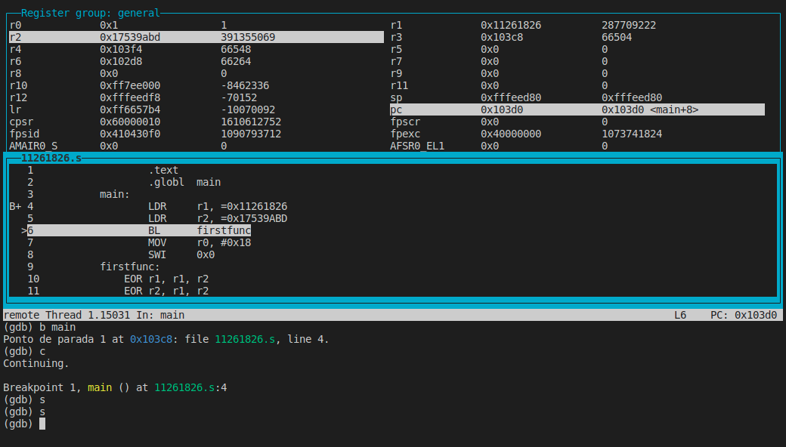
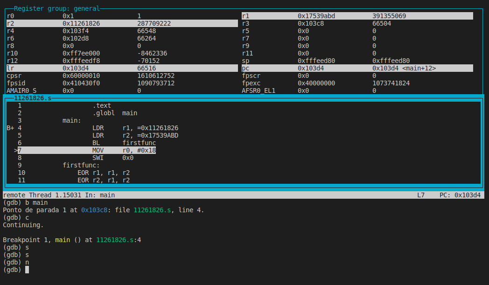

# PCS3432 - Laboratório de Processadores

##### Tarefa - E2

Bruno Mariz - 11261826

---

### 3.10.4 Register-swap algorithm
The EOR instruction is a fast way to swap the contents of two registers without using
an intermediate storage location such as a memory location or another register. Suppose
two values A and B are to be exchanged. The following algorithm could be used:
A = A ⊕ B
B = A ⊕ B
A = A ⊕ B
Write the ARM code to implement the above algorithm, and test it with the values of
A = 0xF631024C and B = 0x17539ABD. Show your instructor the contents before and after
the program has run.

### 2.6 tarefa E2 - codigo + saida gdb (INDIVIDUAL) -entrega durante o laboratório

Sem zipar nada, entreguem os arquivos que correspondem ao exercício 3.10.4:

Retorne o seu código que resolve 3.10.4 (Register-swap algorithm). No PDF temos os valores: A = 0xF631024C and B = 0x17539ABD. O seu programa deve colocar A no registrador R1 e B em R2, além disso: Caso seu NUSP for: par: troque A pelo seu NUSP e mantenha B. ímpar: troque B pelo seu NUSP e mantenha A. 

Exemplo: 

>Supondo que seu NUSP seja 1234 (decimal), você. pode colocar seu NUSP em r1 da seguinte forma:
>LDR r1, =1234

Programa utilizado na tarefa:

```assembly
	.text
	.globl	main
main:
	LDR	r1, =0x11261826
	LDR	r2, =0x17539ABD
	BL	firstfunc
	MOV	r0, #0x18
	SWI	0x0
firstfunc:
    EOR r1, r1, r2
    EOR r2, r1, r2
    EOR r1, r1, r2
    MOV	pc, lr
```

Estado dos registradores antes de rodar a função:

Estado dos registradores após rodar a função:


É possível observar que os registradores r1 e r2 foram trocados após a execução da função. 

Isso acontece pois x ⊕ x = 0, portanto 

a = a ⊕ b

b = a ⊕ b, que equivale a: a ⊕ b ⊕ b = a

a = a ⊕ b, que equivale a: a ⊕ b ⊕ a = b
