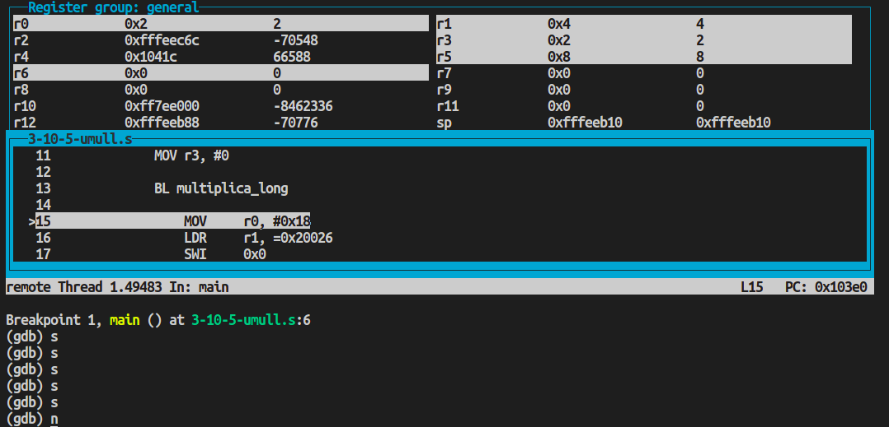
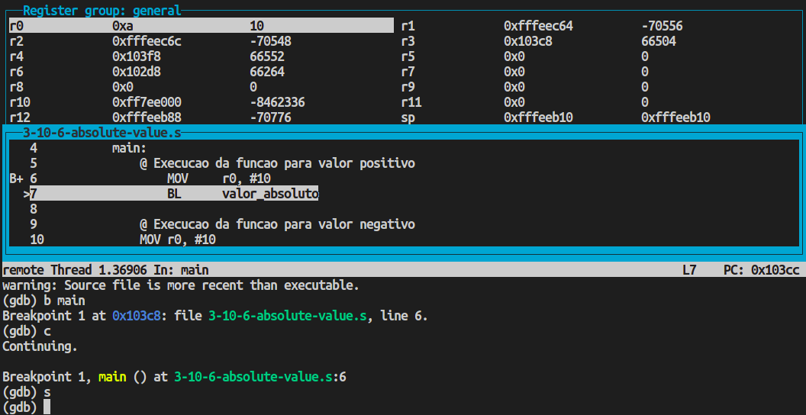
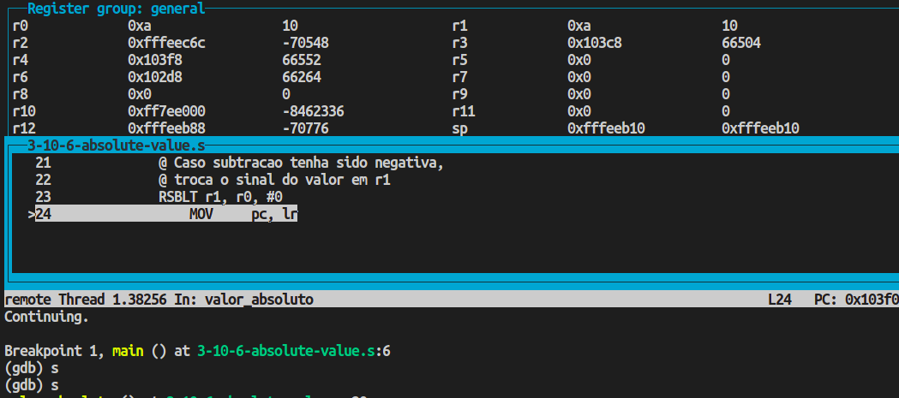
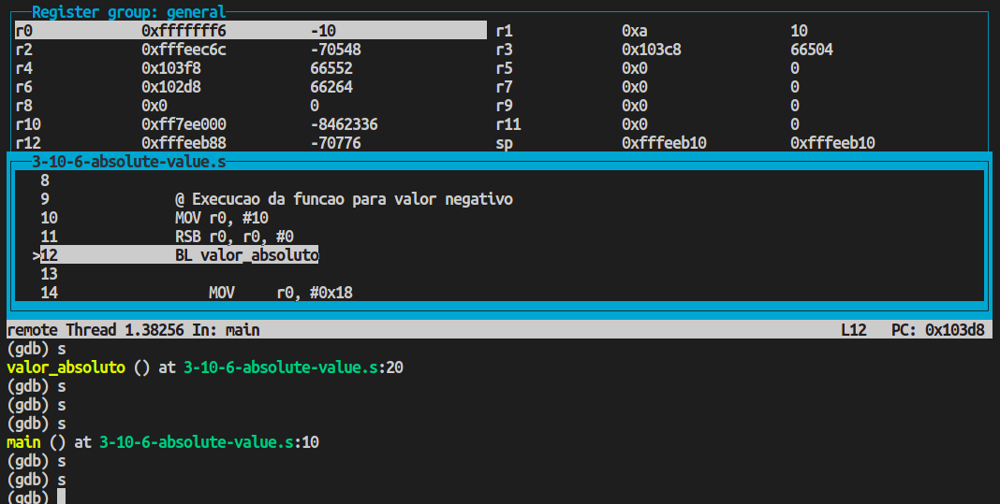
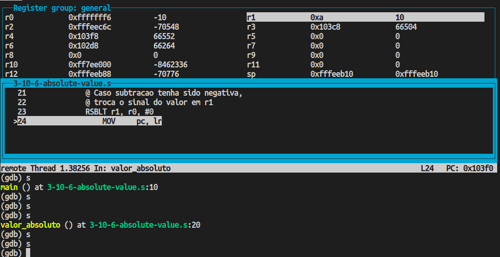
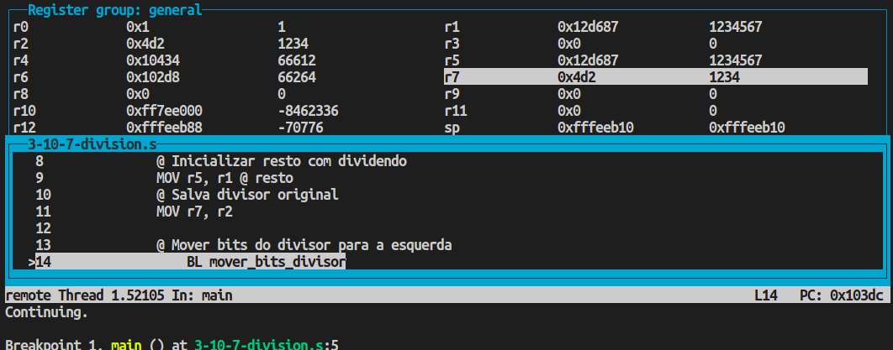
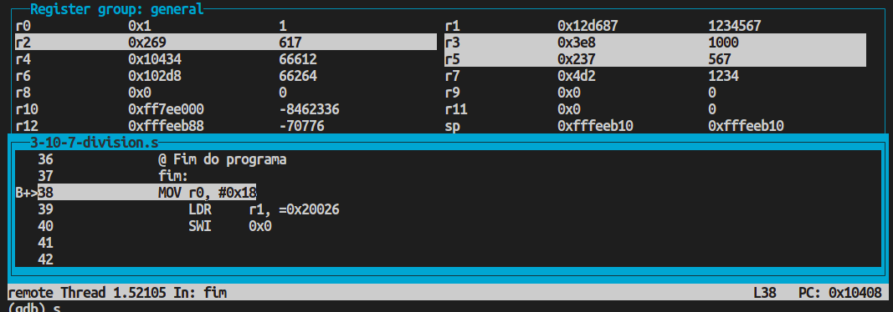

# PCS3432 - Laboratório de Processadores

##### Relatório - E3

| Bancada B8      |          |
| --------------- | -------- |
| Bruno Mariz     | 11261826 |
| Roberta Andrade | 11260832 |

---

### 3.3.2 Exercicio 3.10.5 - Signed multiplication

###### Não percam tempo com a restrição do PDF ARM Lab: usem instruções condicionais para facilitar. No cap. 5 do PDF Arm lab manual existe uma tabela com todas as condições possiveis. Dê preferência, façam primeiro o exercicio 3.10.6. Há um pequeno erro na explicação sobre UMULL no PDF, explicado no item 3.10.2 do PDF.

### 3.10.5 Signed multiplication

###### Assume that a signed long multiplication instruction is not available. Write a program that performs long multiplications, producing 64 bits of result. Use only the UMULL instruction and logical operations such as MVN to invert, XOR, and ORR. Run the program using the two operands –2 and –4 to verify.

Código utilizado:

```assembly
@ 3.10.5
	.text
	.globl	main
main:
    @ Define argumentos
    MOV r0, #2
    RSB r0, r0, #0 @ troca sinal de r0
    MOV r1, #4
    RSB r1, r1, #0 @ troca sinal de r1
    @ Inicializa contador de argumentos negativos
    MOV r3, #0

    BL multiplica_long

	MOV	r0, #0x18
	LDR	r1, =0x20026
	SWI	0x0

multiplica_long:
    @ Contar argumentos negativos e troca sinal caso forem negativos
    CMP r0, #0
    ADDLT r3, r3, #1
    RSBLT r0, r0, #0 @ troca sinal de r0 se for negativo
    CMP r1, #0
    ADDLT r3, r3, #1
    RSBLT r1, r1, #0 @ troca sinal de r0 se for negativo
    UMULL r5, r6, r0, r1 @ multiplica os numeros
    CMP r3, #1 @ checa se apenas um operando era negativo
    @ Caso apenas um operando for negativo, trocar o sinal do resultado
    RSBEQS r5, r5, #0
    RSCEQ r6, r6, #0

	MOV	pc, lr

```

Após a execução do código, os registradores de resultado r5 e r6 ficaram com os valores esperados de r6 = 0 (bits mais significativos) e r5 = 8 (bits menos significativos)



---

### 3.3.3 Exercicio 3.10.6 - Absolute value

###### Dica: para se obter o valor absoluto de um número é efetuar (zero - número) caso o número seja negativo.

### 3.10.6 Absolute value

###### Write ARM assembly to perform the function of absolute value. Register r0 contains the initial value, and r1 contains the absolute value. Try to use only two instructions, not counting the SWI to terminate the program.

Programa utilizado no exercício:

```assembly
@ 3.10.6
	.text
	.globl	main
main:
    @ Execucao da funcao para valor positivo
	MOV	r0, #10
	BL	valor_absoluto

    @ Execucao da funcao para valor negativo
    MOV r0, #10
    RSB r0, r0, #0
    BL valor_absoluto

	MOV	r0, #0x18
	LDR	r1, =0x20026
	SWI	0x0

valor_absoluto:
    @ Subtrai valor de 0 e atualiza flags, e salva resultado em r1
    SUBS r1, r0, #0
    @ Caso subtracao tenha sido negativa,
    @ troca o sinal do valor em r1
    RSBLT r1, r0, #0
	MOV	pc, lr
```

O programa acima executou a subrotina "valor absoluto" para um valor positivo e um valor negativo.

Para o valor positivo, o valor dos registradores antes da função ser executada foi:

r0 = 10



Após a execução da função, o valor dos registradores se tornou:

r0 = 10,

r1 = 10



Para o valor negativo, o valor dos registradores antes da função ser executada foi:

r0 = -10



Após a execução da função, o valor dos registradores se tornou:

r0 = - 10,

r1 = 10



---

### 3.3.4 Exercicio 3.10.7 Division

###### Veja: http://courses.cs.vt.edu/~cs1104/Division/ShiftSubtract/Shift.Subtract.html e coloque no papel a simulação de 1101 dividido por 10. Verifique se há algum erro na solução.

###### Não é necessário se preocupar-se caso esteja falhando para codigos onde o bit de sinal do dividendo seja 1.

Código utilizado:

```assembly
	.text
	.globl	main
main:
    @ Inicializar parametros
    LDR r1, =1234567 @ dividendo
    LDR r2, =1234 @ divisor
    MOV r3, #0x0 @ quociente
    @ Inicializar resto com dividendo
    MOV r5, r1 @ resto
    @ Salva divisor original
    MOV r7, r2

    @ Mover bits do divisor para a esquerda
	BL mover_bits_divisor

    @ Comparar dividendo divisor
    if_compara_dividendo_divisor:
    CMP r5, r2
    BGE cabe
    nao_cabe:
    @ Concatena 0 ao fim do quociente
    LSL r3, #1
    B desloca_divisor
    cabe:
    @ Subtrai divisor do dividendo
    SUB r5, r5, r2
    @ Concatena 1 ao fim do quociente
    LSL r3, #1
    ADD r3, #1
    desloca_divisor:
    LSR r2, #1
    until_compara_divisor_com_original:
    CMP r2, r7
    BGE if_compara_dividendo_divisor

    @ Fim do programa
    fim:
    MOV	r0, #0x18
	LDR	r1, =0x20026
	SWI	0x0


mover_bits_divisor:
    @ Checa se primeiro bit do r2 eh 1
	TST     r2, #0x40000000
    BEQ    a_mbd @ se for 0, faz o salto
	MOV	    pc, lr @ se for 1, volta para o programa
a_mbd:
    LSL r2, #1  @ desloca bits do r2 para a esquerda
    B mover_bits_divisor
```

Antes da execução do código, o estado dos registradores era o seguinte:



Após a execução do código, o estado dos registradores era o seguinte:



É possível observar que foi realizada a divisão de 1234567 por 1234 que resultou em um quociente r3 = 1000 com resto r5 = 567.

---

### 3.10.8 Gray codes

###### A Gray code is an ordering of 2n binary numbers such that only one bit changes from one entry to the next. One example of a 2-bit Gray code is b10 11 01 00. The spaces in this example are for readability. Write ARM assembly to turn a 2-bit Gray code held in r1 into a 3-bit Gray code in r2.

###### Note

###### The 2-bit Gray code occupies only bits [7:0] of r1, and the 3-bit Gray code occupies

###### only bits [23:0] of r2. You can ignore the leading zeros.

###### One way to build an n-bit Gray code from an (n – 1)-bit Gray code is to prefix every (n – 1)-bit element of the code with 0. Then create the additional n-bit Gray code elements by reversing each (n – 1)-bit Gray code element and prefixing it with a one. For example, the 2-bit Gray code above becomes b010 011 001 000 101 111 110 100.
