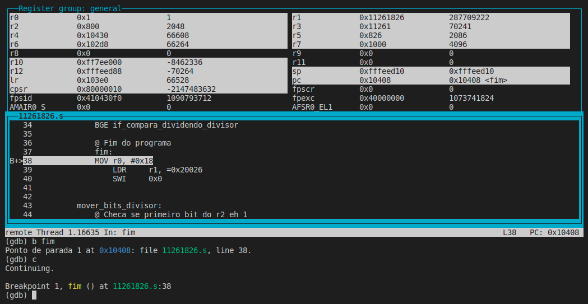

# PCS3432 - Laboratório de Processadores

##### Tarefa - E3

Bruno Mariz - 11261826

---

Resultado nos registradores apos a execução do código:

| Registrador| Valor (hex) | Valor (decimal)| Parâmetro |
| --- | ------- | ----- | -|
| r5 | 0x826 | 2086 | resto
| r3 | 0x11261 | 70241 | quociente

