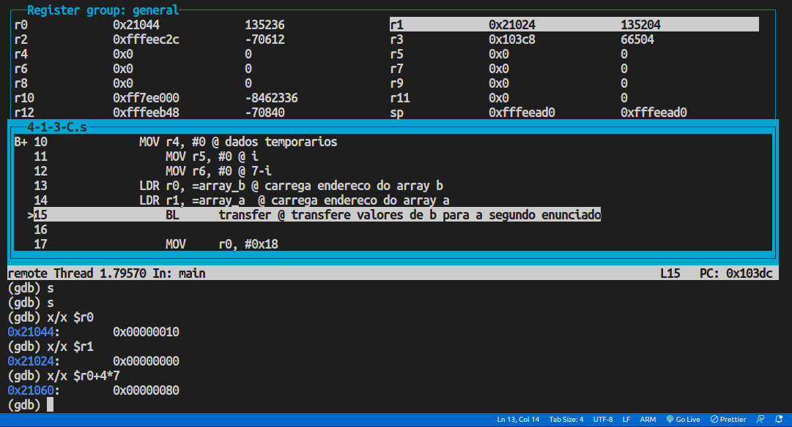

# PCS3432 - Laboratório de Processadores

##### Planejamento - E4

Bruno Mariz - 11261826

---

### B.1) Descreva o conteúdo do registrador R13 ou sp depois que as seguintes instruções forem executadas, assumindo que a memória contenha os valores mostrados abaixo. O registrador R0 contém 0x24, e o sistema de memória é little-endian (o menos significativo é colocado no endereco mais baixo).

| Endereço | Conteúdo |
| -------- | -------- |
| 0x24     | 0x06     |
| 0x25     | 0xFC     |
| 0x26     | 0x03     |
| 0x27     | 0xFF     |

```
LDRSB sp, [r0] @ -> sp = 0x00000006
LDRSH sp, [r0] @ -> sp = 0xFFFFFC06
LDR sp,[r0]    @ -> sp = 0xFF03FC06
LDRB sp,[r0]   @ -> sp = 0x00000006
```

### B.2) Indique se as seguintes instruções usam o modo pré ou pós indexado de endereçamento:

STR r6, [r4,#4] &rarr; pre-indexado
LDR r3, [r12], #6 &rarr; pos-indexado
LDRB r4, [r3,r2]! &rarr; pre-indexado (com writeback)
LDRSH r12, [r6] &rarr; pos-indexado

### B.3) Calcule o endereço efetivo das seguintes instruções se o registrador r3 = 0x4000 e o registrador r4 = 0x20

STRB r9, [r3,r4] &rarr; endereço: 0x4020
LDRB r8,[r3,r4,LSL #3] &rarr; endereço: 0x4100
LDR r7, [r3], r4 &rarr; endereço: 0x4000
STRB r6, [r3], r4, ASR #2 &rarr; endereço: 0x4000

### B.4) O que há de errado na seguinte instrução? Veja "incorrect example" em: http://infocenter.arm.com/help/index.jsp?topic=/com.arm.doc.dui0068b/Chdbifed.html

```
LDRSB r1,[r6],r3,LSL #4
```

### 4.1.3 C - escreva codigo

######Escreva o código em Assembly que faça:

```c
for (i=0; i<8; i++) {
  a[i] = b[7-i];
}
```

###### instalar o gnuarm na maquina de voces e testar. Procurem usar as seguintes instrucoes em seu código:

- LDR ou ADR (isto é: declarem os dados na memória e leiam de lá; por exemplo, onde comeca o a array b e a array a).
- BGE (usem instrucoes que facam o desvio condicional, nao necessariamente BGE).
- RSB (para o 7-i)
- STR (isto é: armazene de fato o dado na memória).

###### Vejam: https://stackoverflow.com/questions/42503417/arm-assembly-arrays/53391341#53391 ou informacoes aqui na aula de hoje sobre como alocar uma array na memoria.

Primeiramente, foi escrito um código que cria os arrays, e carrega seus endereços nos registradores r0 e r1 utilizando a instrução ADR, seguindo o link indicado no enunciado, com a modificação de retirar a seção .data, que impediu o uso da instrução ADR (seria necessário utilizar LDR) e o conteúdo dos arrays foi observado conforme na imagem a seguir:



A seguir, foi desenvolvida uma função que transfere o conteúdo de um array para o outro conforme o enunciado, e o conteúdo do segundo array foi observado conforme na imagem a seguir:


