# PCS3432 - Laboratório de Processadores

##### Relatório - E4

| Bancada B8      |          |
| --------------- | -------- |
| Bruno Mariz     | 11261826 |
| Roberta Andrade | 11260832 |

---

### 4.5.1 Assignments with operands in memory

###### Assume an array of 25 words. A compiler associates variables x and y with registers r0 and r1, respectively. Assume that the base address for the array is located in r2.

###### Translate this C statement/assignment using the post-indexed form:

> x = array[5] + y

###### Now try writing it using the pre-indexed form

Código utilizado no exercício:

```assembly
@ 4.5.1
.text
.global main
main:
    @ r0: x
    @ r1: y
    @ r2: array
    @ r3: indice
    @ r4: tmp
    @ x = array[5] + y
    MOV r3, #5
pos_indexado:
    MOV r0, #0
    ADR r2, array
    MOV r1, #0xc
    @ Carregando com o modo pos-indexado
    ADD r4, r2, r3, LSL #2
    LDR r0, [r4], #0
    ADD r0, r0, r1
pre_indexado:
    MOV r0, #0
    ADR r2, array
    MOV r1, #0xc
    @ Carregando com o modo pre-indexado
    LDR r0, [r2, r3, LSL #2]
    ADD r0, r0, r1

fim:
    MOV	r0, #0x18
	LDR	r1, =0x20026
	SWI	0x0

array:
    .word 0x1, 0x2, 0x3, 0x4, 0x5, 0x6, 0x7, 0x8, 0x9, 0xa

```

Ao executar o código acima, foi possível observar o valor esperado no registrador r0 (x = array[5]+y, ou r0 = 6+12 = 18) tanto utilizando o modo pós indexado quanto utilizando o modo pré indexado, como é possível observar nas imagens a seguir:


<p style="text-align:center;">Resultado utilizando modo pós indexado</p>


<p style="text-align:center;">Resultado utilizando modo pre indexado</p>

---

### 4.5.2 Loads and stores

###### Assume an array of 25 words. A compiler associates y with r1. Assume that the base address for the array is located in r2. Translate this C statement/assignment using the post-indexed form:

```c
array[10] = array[5] + y
```

###### Now try it using the pre-indexed form.

Código utilizado no exercício:

```assembly
@ 4.5.2
.text
.global main
main:
    @ r1: y
    @ r2: array
    @ r3: indice 1
    @ r4: indice 2
    @ r5: tmp
    @ r6: tmp
    @ array[10] = array[5] + y
    MOV r3, #5
    MOV r4, #10
pos_indexado:
    @ y = 4000
    MOV r1, #0x4000
    LDR r2, =array

    @ Carregando com o modo pos-indexado

    @ r5 = &(array[r3])
    ADD r5, r2, r3, LSL #2
    @ r5 = array[r3]
    LDR r5, [r5], #0
    @ r5 = array[r3] + y
    ADD r5, r5, r1
    @ r6 = &(array[r4])
    ADD r6, r2, r4, LSL #2
    @ array[r4] = array[r3] + y
    STR r5, [r6], #0

pre_indexado:
    @ Carregando com o modo pre-indexado

    @ Mudando indice 2 para variar do modo pos-indexado
    MOV r4, #11
    @ r5 = array[r3]
    LDR r5, [r2, r3, LSL #2]
    @ r5 = array[r3] + y
    ADD r5, r5, r1
    @ array[r4] = array[r3] + y
    STR r5, [r2, r4, LSL #2]

fim:
    MOV	r0, #0x18
	LDR	r1, =0x20026
	SWI	0x0

.data
array:
    .word 0x0, 0x1, 0x2, 0x3, 0x4, 0x5, 0x6, 0x7, 0x8, 0x9, 0xa, 0xb, 0xc, 0xd, 0xe, 0xf, 0x10, 0x11, 0x12, 0x13, 0x14, 0x15, 0x16, 0x17, 0x18

```

Ao executar o código acima, foi possível observar o valor esperado no array após executar o comando de print <span style="font-family: Courier New, Courier">x/28wx &array</span>, tanto utilizando o modo pós indexado quanto utilizando o modo pré indexado, como é possível observar nas imagens a seguir:


<p style="text-align:center;">Estado dos registradores e array antes de executar a instrução de store utilizando modo pós indexado</p>


<p style="text-align:center;">Resultado utilizando modo pós indexado. É possível observar que a 11.a posição do array possui a soma de y com a 6.a posição do array.</p>

Para a execução com o modo pré-indexado, foi alterada a posição onde foi guardado o resultado da soma para diferenciar do modo pós indexado, portanto o resultado foi salvo em <span style='font-family: Courier New, Courier'>array[11]</span>:


<p style="text-align:center;">Resultado utilizando modo pré indexado. É possível observar que a 12.a posição do array possui a soma de y com a 6.a posição do array.</p>

Para esse exercício, foi necessário separar o programa em área de texto e de dados para que fosse possível escrever o resultado no array, portanto foi necessário utilizar a instrução LDR em vez da instrução ADR.

---

### 4.5.3 Array assignment

###### Write ARM assembly to perform the following array assignment in C:

```c
for ( i = 0; i <= 10; i++) {a[i] = b[i] + c;}
```

###### Assume that r3 contains i, r4 contains c, a starting address of the array a in r1, and a starting address of the array b in r2.

Código utilizado no exercício:

```assembly
@ 4.5.3
.text
.global main
main:
    @ r1: a
    @ r2: b
    @ r3: i
    @ r4: c
    @ r5: tmp

    LDR r1, =a
    LDR r2, =b
    MOV r3, #0
    MOV r4, #0x4000

pronto:
check_i_le_10:
    CMP r3, #10
    BGT fim
    @ r5 = b[i]
    LDR r5, [r2, r3, LSL #2]
    @ r5 = b[i] + c
    ADD r5, r5, r4
    @ a[i] = r5
    STR r5, [r1, r3, LSL #2]
    @ i++
    ADD r3, r3, #1
    B check_i_le_10

fim:
    MOV	r0, #0x18
	LDR	r1, =0x20026
	SWI	0x0

.data
a:  .space 44
b:
    .word 0x0, 0x1, 0x2, 0x3, 0x4, 0x5, 0x6, 0x7, 0x8, 0x9, 0xa

```

Estado dos registradores e arrays antes da execução:

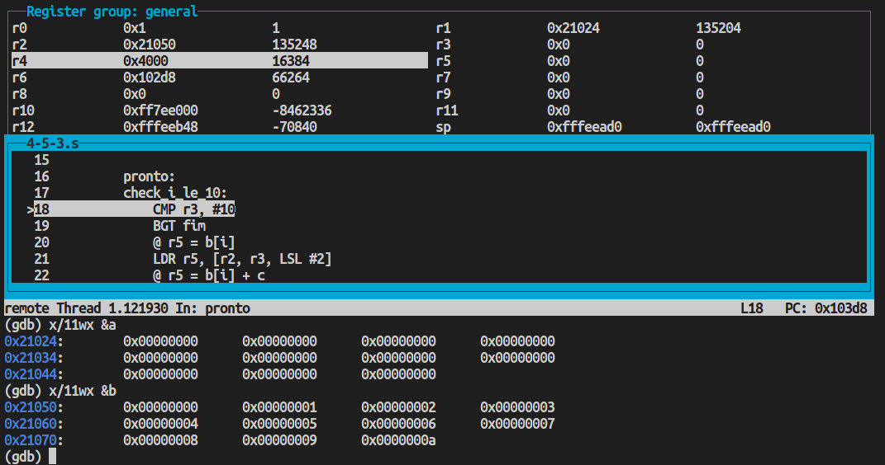

Estado após a primeira iteração:

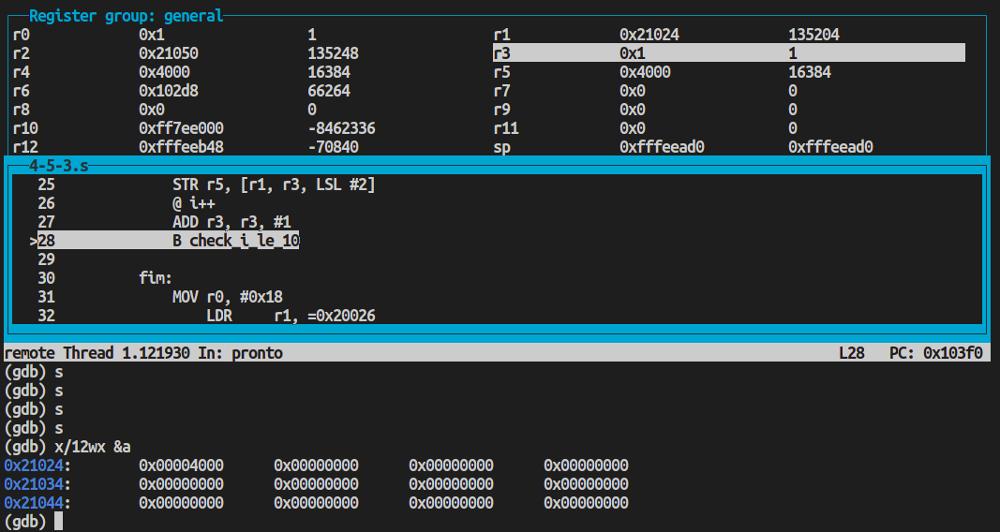

Estado ao final do loop:

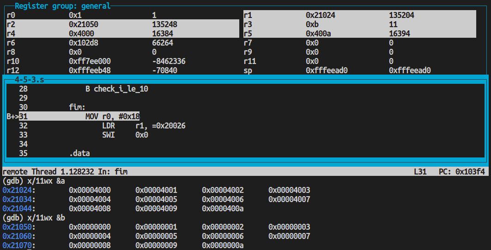

---

### 4.5.4 Arrays and pointers

###### Consider the following two C procedures, which initialize an array to zero using a) indices, and b) pointers:

###### a)

```
init_Indices (int a[], int s) {
    int i;
    for ( i = 0; i < s; i ++)
        a[i] = 0; }
```

###### b)

```
init_Pointers (int *array, int s) {
    int *p;
    for (p = &array[0]; p < &array[s]; p++)
        *p = 0; }
```

###### Convert these two procedures to ARM assembly. Put the starting address of the array in r1, s in r2, and i and p in r3. Assume that s > 0 and that you have an array of bytes.

Código utilizado no exercício:

```assembly
@ 4.5.4
.text
.global main
main:
    @ r1: a
    @ r2: s
    @ r3: i/p
    @ r4: zero
    @ r5: &array[s]

    LDR r1, =a
    MOV r2, #0x10
    MOV r4, #0

    BL init_indices
    BL init_pointers
    B fim

init_indices:
    @ i = 0
    MOV r3, #0
check_i_lt_s:
    CMP r3, r2
    @ retorna da funcao
    MOVGE pc, lr
    STRB r4, [r1, r3]
    @ i++
    ADD r3, r3, #1
    B check_i_lt_s

init_pointers:
    @ p = &array[0]
    LDR r3, =array
    @ r5 = &array[s]
    ADD r5, r3, r2
check_p_lt_array_s:
    CMP r3, r5
    MOVGE pc, lr
    STRB r4, [r3], #1
    B check_p_lt_array_s

fim:
    MOV	r0, #0x18
	LDR	r1, =0x20026
	SWI	0x0

.data
a:  .byte 0xaa, 0xaa, 0xaa, 0xaa, 0xaa, 0xaa, 0xaa, 0xaa, 0xaa, 0xaa, 0xaa, 0xaa, 0xaa, 0xaa, 0xaa, 0xaa, 0xaa, 0xaa, 0xaa, 0xaa

array: .byte 0x01, 0x02, 0x03, 0x04, 0x05, 0x06, 0x07, 0x08, 0x09, 0x0a, 0x0b, 0x0c, 0x0d, 0x0e, 0x0f, 0x10, 0x11, 0x12, 0x13, 0x14

```

a)

Estado dos registradores e memória antes da execução do loop:

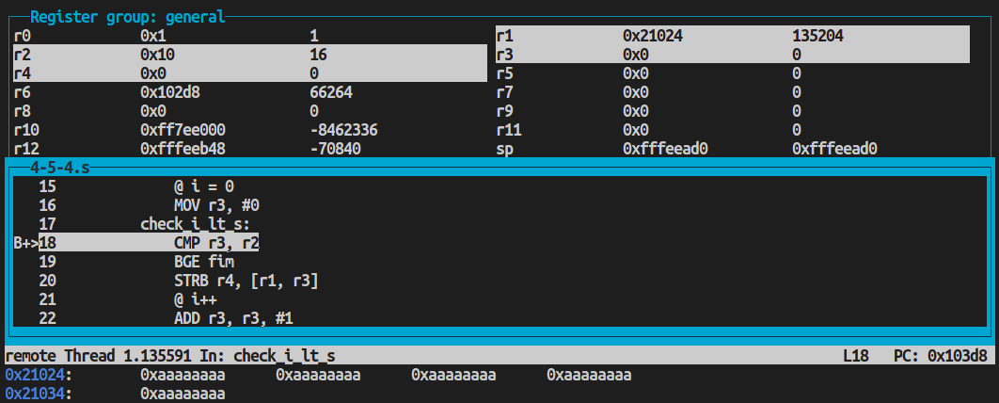

Estado dos registradores e memória após a execução do loop:

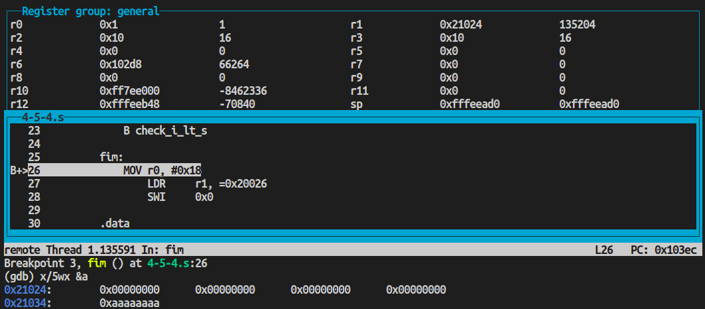

Note que o array a foi inicializado com 20 bytes 0xaa, porém o código utiliza s=16 para facilitar a visualização da parada do loop, portanto apenas os 16 primeiros bytes foram alterados para 0 pela subrotina.

b)
Estado dos registradores e memória antes da execução do loop:

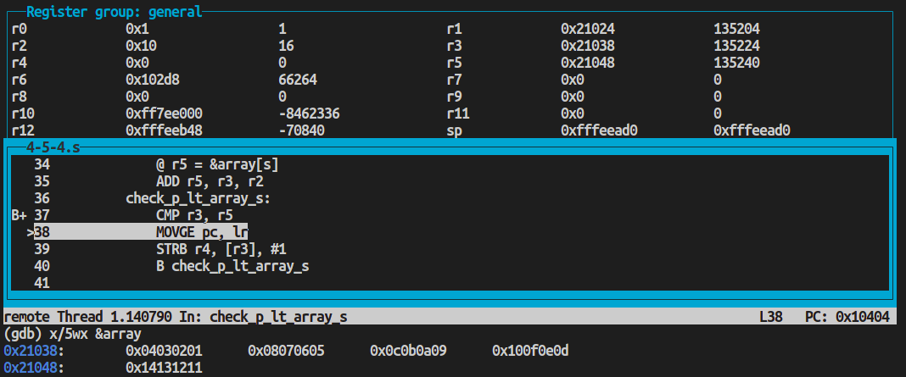

Estado dos registradores e memória após a execução do loop:

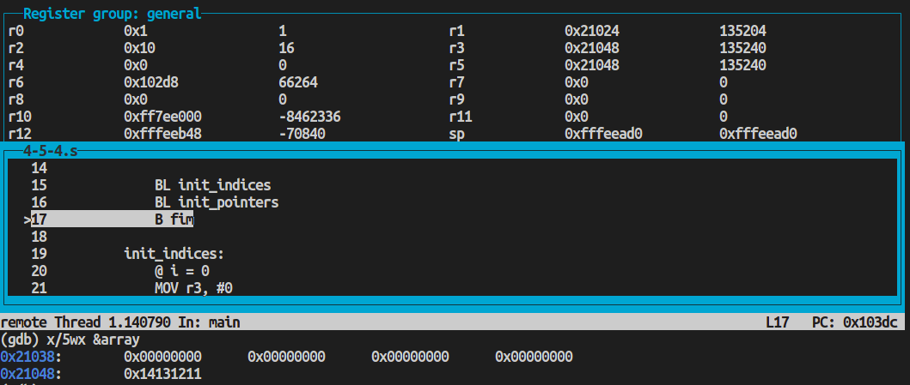

Note que o array "array" foi inicializado com 20 bytes 0x01, 0x02, ..., 0x14, porém o código utiliza s=16 para facilitar a visualização da parada do loop, portanto apenas os 16 primeiros bytes foram alterados para 0 pela subrotina.

---

### 4.5.5 The Fibonacci sequence

###### The Fibonacci sequence is an infinite sequence of numbers such that:

```
f(0) = 0
f(1) = 1
f(2) = 1
f(3) = 2
f(4) = 3
f(5) = 5
f(6) = 8
.
.
.
f(n) = f(n – 1) + f(n – 2).
```

###### Write an ARM assembly program that computes the first 12 numbers of the sequence and stores the sequence in memory locations 0x4000 to 0x400B. Assume everything can be in bytes, because f(12) is the first number of the sequence that falls out of the byte range. You must use a loop, and only f(0) and f(1) can be stored outside the loop.

Código utilizado no exercício:

```assembly
@ 4-5-5 Fibonacci
.text
.global main
main:
    @ r0: n
    @ r1: a
    @ r2: a[i]
    @ r3: a[i-1], tmp
    @ r4: a[i-2], tmp
    @ r5: indice
    @ r6: tmp
    MOV r0, #12
pronto:
    @ r1 = a
    LDR r1, =a
    @ i = 0
    MOV r5, #0
    @ Inicializar a[0] e a[1] com 0 e 1
    MOV r6, #0
    STR r6, [r1, r5, LSL #2] @ a[0] = 0
    ADD r5, r5, #1 @ i++
    MOV r6, #1
    STR r6, [r1, r5, LSL #2] @ a[1] = 1
    ADD r5, r5, #1 @ i++
check_i_gt_n:
    CMP r5, r0
    BGT fim
    @ r3 = a[i-1]
    SUB r3, r5, #1
    LDR r3, [r1, r3, LSL #2]
    @ r4 = a[i-2]
    SUB r4, r5, #2
    LDR r4, [r1, r4, LSL #2]
    @ r2 = a[i-1] + a[i-2]
    ADD r2, r3, r4
    @ a[i] = r2
    STR r2, [r1, r5, LSL #2]
    @ i++
    ADD r5, r5, #1
    B check_i_gt_n

fim:
    @ r6 = a[n]
    LDR r6, [r1, r0, LSL #2]
    @ r3 = &ultimo
    LDR r3, =ultimo
    @ ultimo = a[n]
    STR r6, [r3]

    MOV	r0, #0x18
	LDR	r1, =0x20026
	SWI	0x0

.data
ultimo: .word 0
@ Array com sequencia de fibonacci
a:
    .space 400

```

É possível observar o estado dos registradores e do array no início do programa no print abaixo:

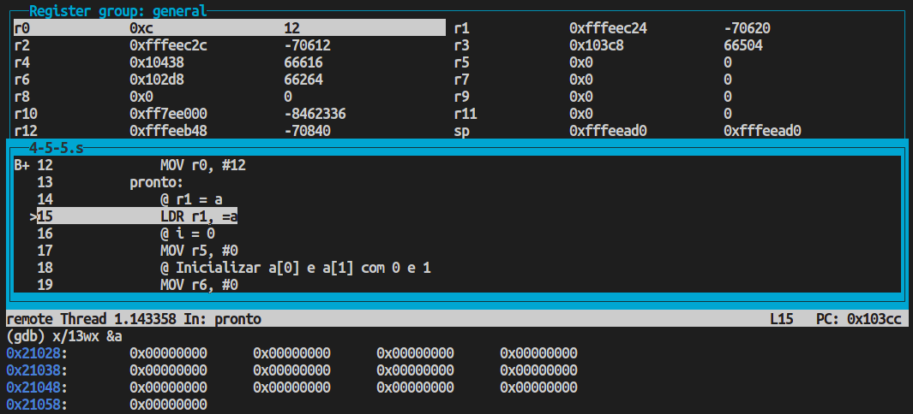

Ao fim do programa, é possível observar a sequência de fibonacci nas posições de memória relativas ao array <span style='font-family: Courier New, Courier'>a</span> utilizando o comando <span style='font-family: Courier New, Courier'>x/13wd &a</span>, e o valor de f(n) com n=12 na posição de memória referente à label <span style='font-family: Courier New, Courier'>ultimo</span>, com o comando <span style='font-family: Courier New, Courier'>x/d &ultimo</span>:

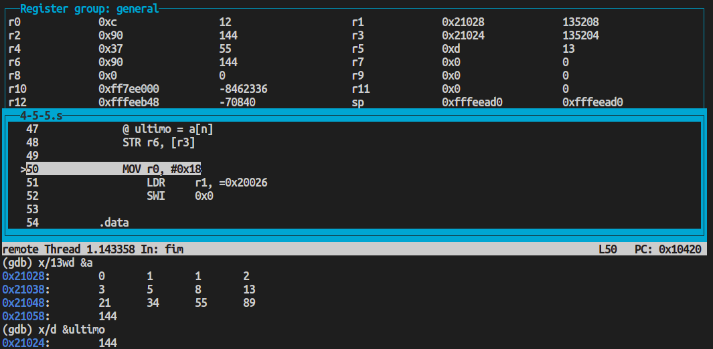

---

### 4.5.6 The nth Fibonacci number

###### See The Fibonacci sequence and write ARM assembly to compute f(n). Start with r1 = n. At the end of the program, r0 = f(n).

Código utilizado no exercício:

```assembly
@ 4-5-6 Nth Fibonacci
.text
.global main
main:
    @ r0: n, f(n)
    @ r1: a
    @ r2: a[i]
    @ r3: a[i-1], tmp
    @ r4: a[i-2], tmp
    @ r5: indice
    @ r6: tmp
    MOV r0, #12
pronto:
    @ i = 2
    MOV r5, #2
    @ Inicializar a[0] e a[1] com 0 e 1
    MOV r3, #1
    MOV r4, #0
check_i_gt_n:
    CMP r5, r0
    BGT fim
    @ r2 = a[i-1] + a[i-2]
    ADD r2, r3, r4
    @ Atualizar valores
    @ r4 = a[i-1]
    MOV r4, r3
    @ r3 = a[i]
    MOV r3, r2
    @ i++
    ADD r5, r5, #1
    B check_i_gt_n

fim:
    @ r0 = f(n)
    MOV r0, r2

    MOV	r0, #0x18
	LDR	r1, =0x20026
	SWI	0x0

.data
ultimo: .word 0
@ Array com sequencia de fibonacci
a:
    .space 400

```

Estado dos registradores antes da execução do código:

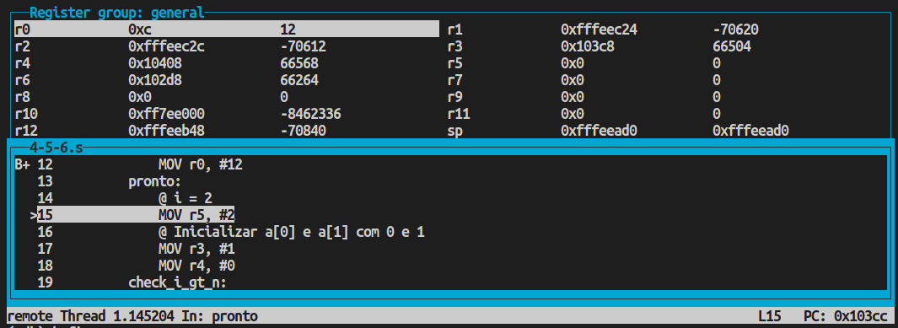

Após a execução do loop, é possível observar o valor correspondente a f(12) = 144 em r0:

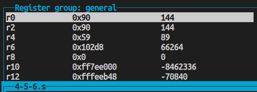
