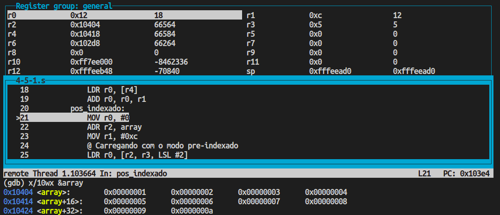
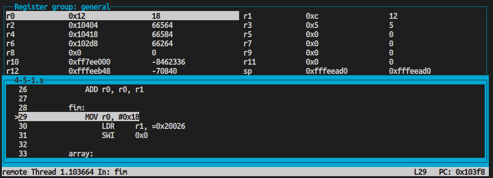
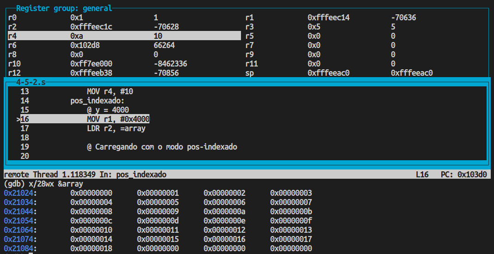
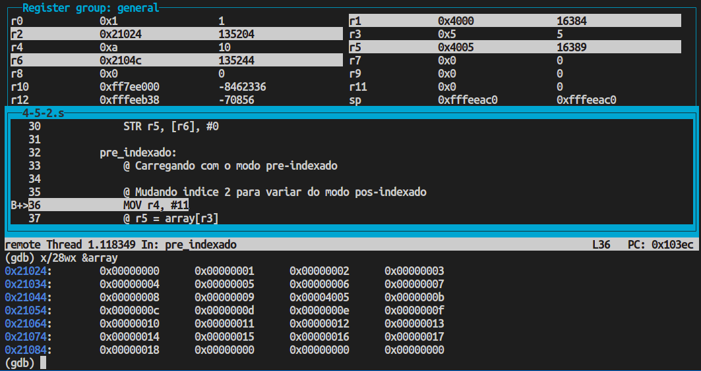
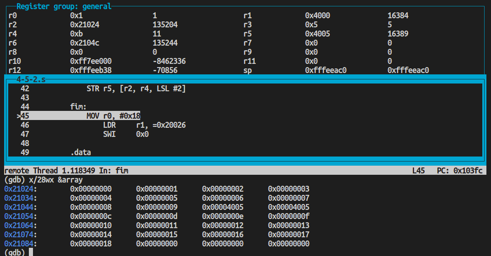

# PCS3432 - Laboratório de Processadores

##### Relatório - E4

| Bancada B8      |          |
| --------------- | -------- |
| Bruno Mariz     | 11261826 |
| Roberta Andrade | 11260832 |

---

### 4.5.1 Assignments with operands in memory

###### Assume an array of 25 words. A compiler associates variables x and y with registers r0 and r1, respectively. Assume that the base address for the array is located in r2.

###### Translate this C statement/assignment using the post-indexed form:

> x = array[5] + y

###### Now try writing it using the pre-indexed form

Código utilizado no exercício:

```assembly
@ 4.5.1
.text
.global main
main:
    @ r0: x
    @ r1: y
    @ r2: array
    @ r3: indice
    @ r4: tmp
    @ x = array[5] + y
    MOV r3, #5
pos_indexado:
    MOV r0, #0
    ADR r2, array
    MOV r1, #0xc
    @ Carregando com o modo pos-indexado
    ADD r4, r2, r3, LSL #2
    LDR r0, [r4], #0
    ADD r0, r0, r1
pre_indexado:
    MOV r0, #0
    ADR r2, array
    MOV r1, #0xc
    @ Carregando com o modo pre-indexado
    LDR r0, [r2, r3, LSL #2]
    ADD r0, r0, r1

fim:
    MOV	r0, #0x18
	LDR	r1, =0x20026
	SWI	0x0

array:
    .word 0x1, 0x2, 0x3, 0x4, 0x5, 0x6, 0x7, 0x8, 0x9, 0xa

```

Ao executar o código acima, foi possível observar o valor esperado no registrador r0 (x = array[5]+y, ou r0 = 6+12 = 18) tanto utilizando o modo pós indexado quanto utilizando o modo pré indexado, como é possível observar nas imagens a seguir:



<p style="text-align:center;">Resultado utilizando modo pós indexado</p>



<p style="text-align:center;">Resultado utilizando modo pre indexado</p>

---

### 4.5.2 Loads and stores

###### Assume an array of 25 words. A compiler associates y with r1. Assume that the base address for the array is located in r2. Translate this C statement/assignment using the post-indexed form:

```c
array[10] = array[5] + y
```

###### Now try it using the pre-indexed form.

Código utilizado no exercício:

```assembly
@ 4.5.2
.text
.global main
main:
    @ r1: y
    @ r2: array
    @ r3: indice 1
    @ r4: indice 2
    @ r5: tmp
    @ r6: tmp
    @ array[10] = array[5] + y
    MOV r3, #5
    MOV r4, #10
pos_indexado:
    @ y = 4000
    MOV r1, #0x4000
    LDR r2, =array

    @ Carregando com o modo pos-indexado

    @ r5 = &(array[r3])
    ADD r5, r2, r3, LSL #2
    @ r5 = array[r3]
    LDR r5, [r5], #0
    @ r5 = array[r3] + y
    ADD r5, r5, r1
    @ r6 = &(array[r4])
    ADD r6, r2, r4, LSL #2
    @ array[r4] = array[r3] + y
    STR r5, [r6], #0

pre_indexado:
    @ Carregando com o modo pre-indexado

    @ Mudando indice 2 para variar do modo pos-indexado
    MOV r4, #11
    @ r5 = array[r3]
    LDR r5, [r2, r3, LSL #2]
    @ r5 = array[r3] + y
    ADD r5, r5, r1
    @ array[r4] = array[r3] + y
    STR r5, [r2, r4, LSL #2]

fim:
    MOV	r0, #0x18
	LDR	r1, =0x20026
	SWI	0x0

.data
array:
    .word 0x0, 0x1, 0x2, 0x3, 0x4, 0x5, 0x6, 0x7, 0x8, 0x9, 0xa, 0xb, 0xc, 0xd, 0xe, 0xf, 0x10, 0x11, 0x12, 0x13, 0x14, 0x15, 0x16, 0x17, 0x18

```

Ao executar o código acima, foi possível observar o valor esperado no array após executar o comando de print <span style="font-family: Courier New, Courier">x/28wx &array</span>, tanto utilizando o modo pós indexado quanto utilizando o modo pré indexado, como é possível observar nas imagens a seguir:



<p style="text-align:center;">Estado dos registradores e array antes de executar a instrução de store utilizando modo pós indexado</p>



<p style="text-align:center;">Resultado utilizando modo pós indexado. É possível observar que a 11.a posição do array possui a soma de y com a 6.a posição do array.</p>

Para a execução com o modo pré-indexado, foi alterada a posição onde foi guardado o resultado da soma para diferenciar do modo pós indexado, portanto o resultado foi salvo em <span style='font-family: Courier New, Courier'>array[11]</span>:



<p style="text-align:center;">Resultado utilizando modo pré indexado. É possível observar que a 12.a posição do array possui a soma de y com a 6.a posição do array.</p>

Para esse exercício, foi necessário separar o programa em área de texto e de dados para que fosse possível escrever o resultado no array, portanto foi necessário utilizar a instrução LDR em vez da instrução ADR.

---

### 4.5.3 Array assignment

###### Write ARM assembly to perform the following array assignment in C:

```c
for ( i = 0; i <= 10; i++) {a[i] = b[i] + c;}
```

###### Assume that r3 contains i, r4 contains c, a starting address of the array a in r1, and a starting address of the array b in r2.
