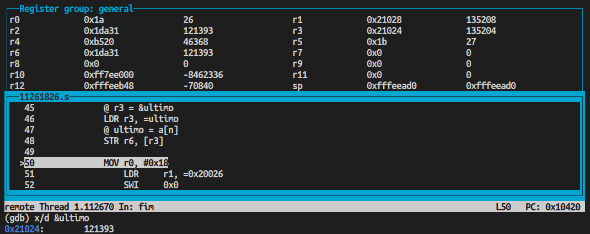

# PCS3432 - Laboratório de Processadores

##### Tarefa - E4

Bruno Mariz - 11261826

---

Código utilizado na tarefa:

```assembly
@ 4-5-5 Fibonacci
.text
.global main
main:
    @ r0: n
    @ r1: a
    @ r2: a[i]
    @ r3: a[i-1], tmp
    @ r4: a[i-2], tmp
    @ r5: indice
    @ r6: tmp
    MOV r0, #26
pronto:
    @ r1 = a
    LDR r1, =a
    @ i = 0
    MOV r5, #0
    @ Inicializar a[0] e a[1] com 0 e 1
    MOV r6, #0
    STR r6, [r1, r5, LSL #2] @ a[0] = 0
    ADD r5, r5, #1 @ i++
    MOV r6, #1
    STR r6, [r1, r5, LSL #2] @ a[1] = 1
    ADD r5, r5, #1 @ i++
check_i_gt_n:
    CMP r5, r0
    BGT fim
    @ r3 = a[i-1]
    SUB r3, r5, #1
    LDR r3, [r1, r3, LSL #2]
    @ r4 = a[i-2]
    SUB r4, r5, #2
    LDR r4, [r1, r4, LSL #2]
    @ r2 = a[i-1] + a[i-2]
    ADD r2, r3, r4
    @ a[i] = r2
    STR r2, [r1, r5, LSL #2]
    @ i++
    ADD r5, r5, #1
    B check_i_gt_n

fim:
    @ r6 = a[n]
    LDR r6, [r1, r0, LSL #2]
    @ r3 = &ultimo
    LDR r3, =ultimo
    @ ultimo = a[n]
    STR r6, [r3]

    MOV	r0, #0x18
	LDR	r1, =0x20026
	SWI	0x0

.data
ultimo: .word 0
@ Array com sequencia de fibonacci
a:
    .space 400

```

Resultado dos registradores ao fim do programa e print x/28wd &a para observar f(0) a f(27) (um a mais que o n relativo ao meu NUSP) no array em memoria:


Resultado dos registradores ao fim do programa e print x/d &ultimo para observar f(26) (n relativo ao meu NUSP) na posição último como indicado no enunciado:


