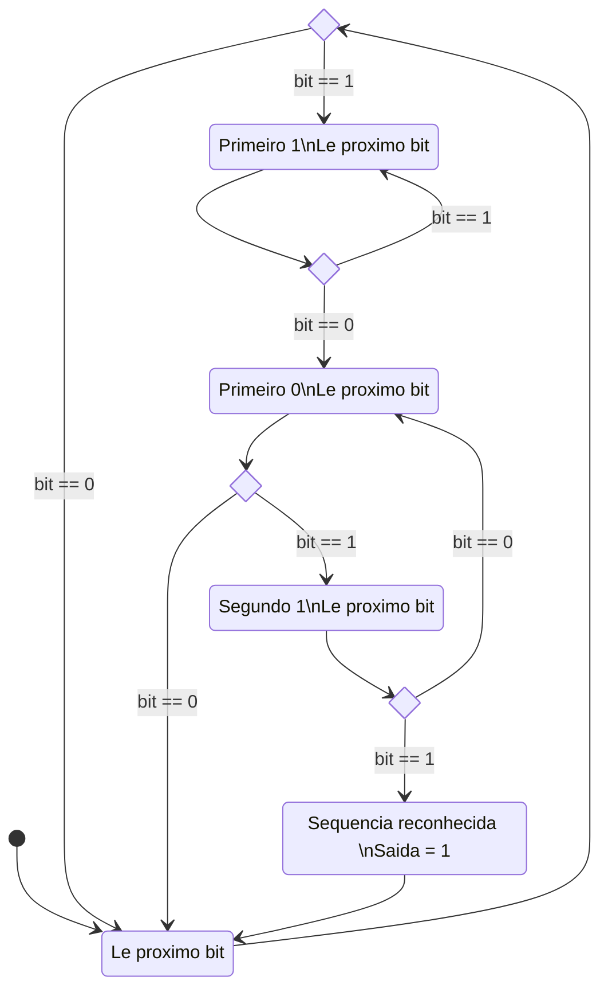

<!--  -->

### Reconhecedor de Sequência

```mermaid
stateDiagram-v2
    state if_state1 <<choice>>
    state if_state2 <<choice>>
    state if_state3 <<choice>>
    state if_state4 <<choice>>
    LePBit: Le proximo bit
    P1: Primeiro 1\nLe proximo bit
    P0: Primeiro 0\nLe proximo bit
    S1: Segundo 1\nLe proximo bit
    Achou: Sequencia reconhecida \nSaida = 1

    [*] --> LePBit

    LePBit --> if_state1
    if_state1 --> P1: bit == 1
    if_state1 --> LePBit : bit == 0

    P1 --> if_state2
    if_state2 --> P0: bit == 0
    if_state2 --> P1: bit == 1

    P0 --> if_state3
    if_state3 --> S1: bit == 1
    if_state3 --> LePBit : bit == 0

    S1 --> if_state4
    if_state4 --> Achou: bit == 1
    if_state4 --> P0 : bit == 0

    Achou --> LePBit
```

