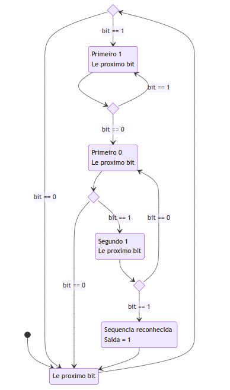
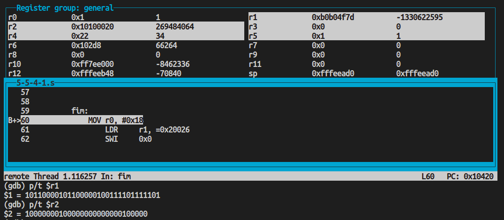

# PCS3432 - Laboratório de Processadores

##### Planejamento - E5

Bruno Mariz - 11261826

---

### 5.1.2 B. Responda:

### 1. Traduza as seguintes instruções em uma única instrução ARM:

###### a. adicione resgistradores r3 e r6 somente se N = 0 (N está "clear"). Armazene o resultado no registrador r7.

<span style='font-family: Courier New, Courier'>ADDPL r7, r3, r6</span>

###### b. adicione resgistradores r3 e r6 somente se N = 1. Armazene o resultado no registrador r7.

<span style='font-family: Courier New, Courier'>ADDMI r7, r3, r6</span>

###### c. Multiplique os registradores r7 e r12, colocando os resultados no registrador r3 somente se C está setado (C = 1) e Z = 0 .

<span style='font-family: Courier New, Courier'>MULHI r3, r7, r12</span>

###### d. Multiplique os registradores r7 e r12, colocando os resulados no registrador r3 somente se C clear ou Z set (obs: tem um erro na apostila na tabela 5-1 pg 5-3)

<span style='font-family: Courier New, Courier'>MULLS r3, r7, r12</span>

###### e. Compare os registradores r6 e r8 somente se Z está zerado.

<span style='font-family: Courier New, Courier'>CMPNE r7, r8</span>

###### f. Compare os registradores r6 e r8 somente se Z set ou N ≠ V

<span style='font-family: Courier New, Courier'>CMPLE r7, r8</span>

### 2. Observe a seguinte função em C:

###### Imagine o trecho de programa em C:

```c
int foo(int x, int y) {
   if ((x + y) >= 0)
         return 0;
   else
         return 1;
}
```

###### Suponha que tenha sido compilado e traduzido no seguinte código:

```assembly
foo       ADDS r0,r0,r1
          BPL PosOrZ
done      MOV r0, #0
          MOV pc, lr
PosOrZ    MOV r0,#1
          B done
```

###### O compilador gerou o código corretamente? O compilador retorna 0 ou 1 em r0. Se não está bom o código, corrija. Altere o código para que ele execute a função em somente 4 instruções (dica: use execucao condicional).

O código foi gerado incorretamente pois ele reornaria 0 quando fosse para retornar 1 e vice-versa, porém após mover 1 incorretamente para r0 nos casos em que a soma x+y fosse maior ou igual a 0, ainda seria feito um branch para "done", então o retorno seria sempre 0. A forma correta seria:

```assembly
foo       ADDS r0,r0,r1
          BPL PosOrZ
Less      MOV r0, #1
          B   done
PosOrZ    MOV r0, #0
done      MOV pc, lr
```

A forma mais compacta utilizando apenas 4 instruções seria:

```assembly
foo   ADDS r0,r0,r1
      MOVMI r0, #1 @ retorna 1 caso a soma for menor que zero
      MOVPL r0, #0 @ retorna 0 caso a soma for maior ou igual a zero
      MOV pc, lr
```

### 5.1.3 C. IMPORTANTE: Implemente, teste, apresentando o printscreen, o codigo de 5.5.4.1

###### 5.5.4 Finite state machines: a nonresetting sequence recognizer

###### Exercicio 5.5.4 1. Consider an FSM with one input X and one output Z. The FSM asserts its output Z when it recognizes an input bit sequence of b1011. The machine keeps checking for the sequence and does not reset when it recognizes the sequence. Here is an example input string X and its output Z:

###### X = ...0010110110...

###### Z = ...0000010010...

###### Write ARM assembly to implement the sequence recognizer. Start with the initial input X in r1. Finish with the output Z in r2 at the end of the program.

Algoritmo (ASM):



Código utilizado no exercício:

```assembly
@ 5-5-4 1
.text
.global main
main:
    @ r1: input X
    @ r2: output Z
    @ r3: aux
    @ r4: counter
    @ r5: constante 1
    LDR r1, =0xb0b04f7d
    MOV r2, #0
    MOV r3, #0
    MOV r4, #0
    MOV r5, #1
pronto:
    MOV r3, r1
le_proximo_bit:
    @ Checa se 'acabou' (input = 0)
    CMP r3, #0
    BEQ fim
    @ Le bit 1
    LSLS r3, r3, #1
    @ Incrementa contador
    ADD r4, r4, #1
    @ Se bit era 0, volta para inicio
    BCC le_proximo_bit

primeiro_1:
    @ Le bit 2 (Primeiro 1)
    LSLS r3, r3, #1
    @ Incrementa contador
    ADD r4, r4, #1
    @ Se bit era 1, volta para mesmo estado
    BCS primeiro_1

primeiro_0:
    @ Le bit 3 (Primeiro 0)
    LSLS r3, r3, #1
    @ Incrementa contador
    ADD r4, r4, #1
    @ Se bit era 0, volta para inicio
    BCC le_proximo_bit

segundo_1:
    @ Le bit 4 (Segundo 1)
    LSLS r3, r3, #1
    @ Incrementa contador
    ADD r4, r4, #1
    @ Se bit era 0, volta para estado anterior
    BCC primeiro_0

sequencia_reconhecida:
    @ Sequencia reconhecida - Adiciona 1 na saida
    ADD r2, r2, r5, ROR r4
    @ Volta para inicio
    BNE le_proximo_bit


fim:
    MOV	r0, #0x18
	LDR	r1, =0x20026
	SWI	0x0

```

Ao fim da execução do programa, foi possível observar o resultado esperado no r2 de acordo com o input no r1 (adicionado espaços para zeros a esquerda no r2):

```
(gdb) p/t $r1
$1 = 10110000101100000100111101111101
(gdb) p/t $r2
$2 =    10000000100000000000000100000
```


