# PCS3432 - Laboratório de Processadores

##### Relatório - E5

| Bancada B8      |          |
| --------------- | -------- |
| Bruno Mariz     | 11261826 |
| Roberta Andrade | 11260832 |

---

### 5.5.1 For loop

###### Code the following C code in assembly. The arrays a and b are located in memory at 0x4000 and 0x5000 respectively. You may wish to type your code into the assembler to check for syntax.

```c
for (i=0; i<8; i++) {
    a[i] = b[7-i];
}
```

O loop acima em C é equivalente ao seguinte código em assembly:

```assembly
    .text
    .globl main

main:

    @   r0  =   i
    @   r1  =   endereço inicial de a
    @   r2  =   endereço inicial de b
    @   r3  =   registrador temporário para transferência
    @   r4  =   endereços de leitura e escrita

    MOV r0, #0
    LDR r1, =0x00       @ loading the address of a[0]
    LDR r2, =0x20       @ loading the address of b[0]
    BL ciclo
    SWI	0x0

ciclo:
    MOV r4, r2
    ADD r4, r4, #28
    SUB r4, r4, r0, LSL #2
    LDR r3, [r4]
    MOV r4, r1
    ADD r4, r4, r0, LSL #2
    STR r3, [r4]
    ADD r0, r0, #1
    CMP r0, #8
    BLT ciclo
    MOV pc, lr

```

---

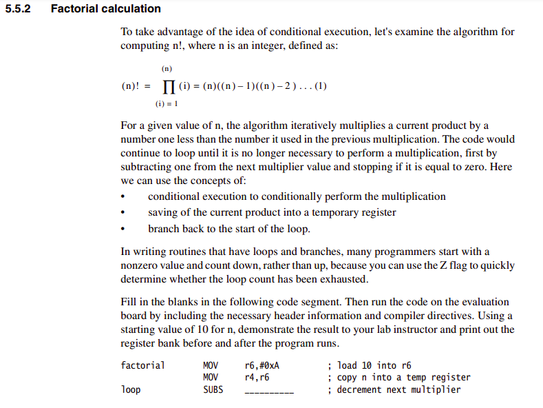

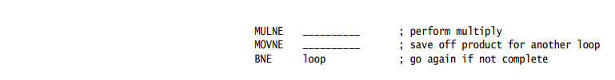

Código utilizado na experiência:

```assembly
@ 5-5-2 Factorial
.text
.global main
main:

    @ r6: n
    @ r4: n copy

factorial:
    MOV r6,#0xA @ load 10 into r6
    MOV r4,r6 @ copy n into a temp register
loop:
    SUBS r4, r4, #1 @ decrement next multiplier
    MULNE r3, r6, r4 @ perform multiply
    MOVNE r6, r3 @ save off product for another loop
    BNE loop @ go again if not complete
fim:
    MOV	r0, #0x18
	LDR	r1, =0x20026
	SWI	0x0

```

Note que mantivemos a instrução "MOVNE", uma vez que o registrador de destino da multiplicação deve ser diferente dos registradores de entrada da operação. Ao executarmos o código sem essa linha, obtivemos o seguinte erro:

```
src_e5/5-5-2.s: Assembler messages:
src_e5/5-5-2.s:14: Rd and Rm should be different in mul
```

Portanto, decidimos incluí-la.

Registradores antes da execução do loop:

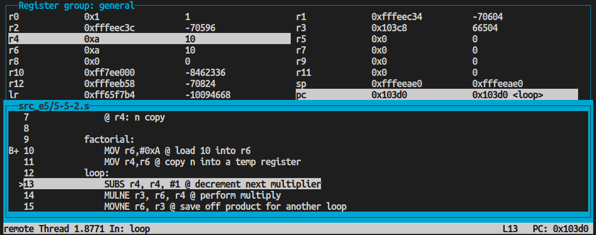

Registradores após da execução do loop, sendo possível observar o resultado 10! = 3628800 em r6:

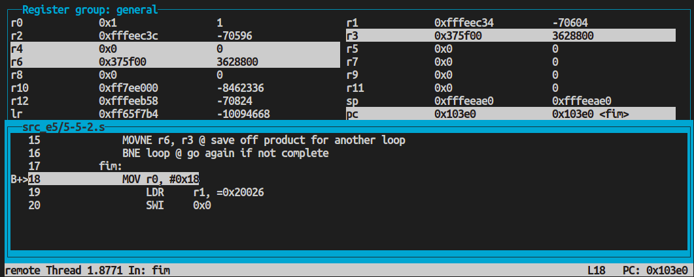

---

### 5.5.3 Find maximum value

###### In this exercise, you are to find the largest integer in a series of 32-bit unsigned integers. The length of the series is determined by the value in register r5. The maximum value is stored in the memory location 0x5000 at the end of the routine. The data values begin at memory location 0x5006. Choose 11 or more integers to use. Use as much conditional execution as possible when writing the code. Demonstrate the program to your lab instructor and print out the memory space starting at 0x5000 before and after the program runs. Be sure to include enough memory space to show all of your 32-bit integer values.

Código utilizado:

```assembly
@ 5-5-3 Max value
.text
.global main
main:
    @ r1: array
    @ r2: i
    @ r3: array[i]
    @ r4: current max
    @ r5: len(array)
    LDR     r1, =array
    MOV     r2, #0
    MOV     r5, #14
    MOV     r4, #0
pronto:
    LDR     r3, [r1, r2, LSL #2] @ r3 = array[i]
    CMP     r3, r4
    MOVHI   r4, r3 @ se r3 > r4, r4 = r3
    ADD     r2, r2, #1 @ i++
    CMP     r2, r5
    BLT     pronto @ se i < len(array), volta

fim:
    MOV 	r0, #0x18
	LDR 	r1, =0x20026
	SWI 	0x0

.data
array: .word 0xa, 0xf, 0x1, 0x2, 0x3, 0x9, 0x8, 0x7, 0x5, 0x6, 0xb, 0xe, 0xc, 0xd

```

Ao fim da execução, foi possível observar o maior valor do array (0xf) em r4, e o último valor checado (0xd) em r3:

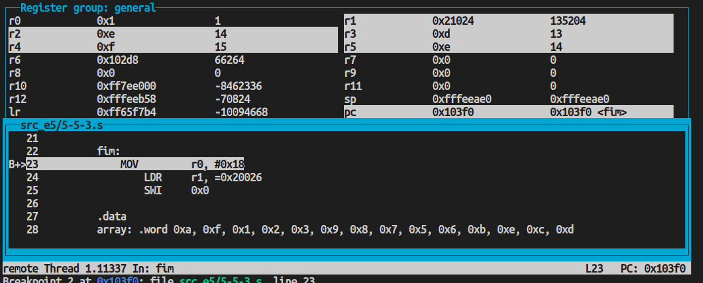

---

### 5.5.4 Finite state machines: a nonresetting sequence recognizer

###### 1. Consider an FSM with one input X and one output Z. The FSM asserts its output Z when it recognizes an input bit sequence of b1011. The machine keeps checking for the sequence and does not reset when it recognizes the sequence. Here is an example input string X and its output Z:

###### X = …0010110110…

###### Z = …0000010010…

###### Write ARM assembly to implement the sequence recognizer. Start with the initial input X in r1. Finish with the output Z in r2 at the end of the program.

Algoritmo (ASM):

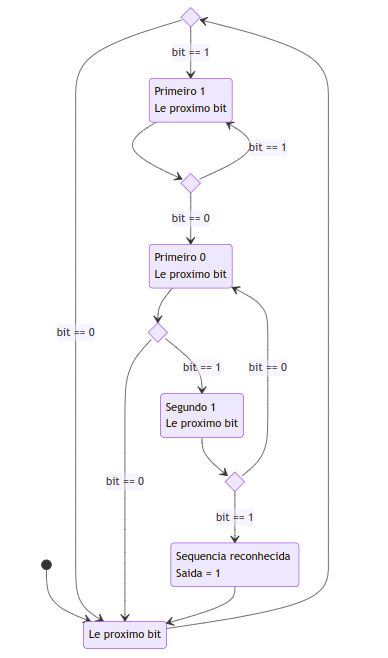

Código utilizado:

```assembly
@ 5-5-4 1
.text
.global main
main:
    @ r1: input X
    @ r2: output Z
    @ r3: aux
    @ r4: counter
    @ r5: constante 1
    LDR r1, =0xb0b04f7d
    MOV r2, #0
    MOV r3, #0
    MOV r4, #0
    MOV r5, #1
pronto:
    MOV r3, r1
le_proximo_bit:
    @ Checa se 'acabou' (input = 0)
    CMP r3, #0
    BEQ fim
    @ Le bit 1
    LSLS r3, r3, #1
    @ Incrementa contador
    ADD r4, r4, #1
    @ Se bit era 0, volta para inicio
    BCC le_proximo_bit

primeiro_1:
    @ Le bit 2 (Primeiro 1)
    LSLS r3, r3, #1
    @ Incrementa contador
    ADD r4, r4, #1
    @ Se bit era 1, volta para mesmo estado
    BCS primeiro_1

primeiro_0:
    @ Le bit 3 (Primeiro 0)
    LSLS r3, r3, #1
    @ Incrementa contador
    ADD r4, r4, #1
    @ Se bit era 0, volta para inicio
    BCC le_proximo_bit

segundo_1:
    @ Le bit 4 (Segundo 1)
    LSLS r3, r3, #1
    @ Incrementa contador
    ADD r4, r4, #1
    @ Se bit era 0, volta para estado anterior
    BCC primeiro_0

sequencia_reconhecida:
    @ Sequencia reconhecida - Adiciona 1 na saida
    ADD r2, r2, r5, ROR r4
    @ Volta para inicio
    BNE le_proximo_bit


fim:
    MOV	r0, #0x18
	LDR	r1, =0x20026
	SWI	0x0

```

Ao fim da execução do programa, foi possível observar o resultado esperado no r2 de acordo com o input no r1 (adicionado espaços para zeros a esquerda no r2):

```
(gdb) p/t $r1
$1 = 10110000101100000100111101111101
(gdb) p/t $r2
$2 =    10000000100000000000000100000
```

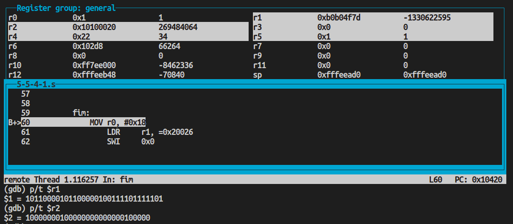

###### 2. Now write the code to recognize any sequence Y up to 32 bits. Start with the recognizing sequence Y in r8 and the size of Y in r9. For example, to recognize the sequence Y = b0110110, then r8 = 0x36 and r9 = 0x7 before program execution. Everything else should be the same is in Step 1. Make sure that your program works for every case, including the case when r9 = 1 or r9 = 32.

Código utilizado no exercício:

```assembly
@ 5-5-4 2
.text
.global main
main:
    @ r0: cte 1
    @ r1: input X
    @ r2: output Z
    @ r3: aux
    @ r4: contador
    @ r5: mask
    @ r6: Y alterado
    @ r7: X apos mascara
    @ r8: Y (sequencia)
    @ r9: tamanho do Y

    LDR r1, =0x5555aaaa @ X
    MOV r2, #0 @ Z
    LDR r8, =0x5555aaaa @ Y - varia para cada teste
    MOV r9, #32 @ size(Y) - varia para cada teste
    @ Inicializa Mask
    MOV r5, #0xFFFFFFFF
    RSB r3, r9, #32
    LSL r5, r5, r3
    @ Move bits de Y para bits mais significativos em registrador auxiliar
    LSL r6, r8, r3
    @ Inicializa contador com size(Y)
    MOV r4, r9
    BAL aplica_mascara

cmp_y_orig:
    @ Compara Y alterado com original
    CMP r8, r6
    BEQ fim

aplica_mascara:
    @ Aplica mascara em X
    AND r7, r5, r1

    @ Compara (X com mask) e (Y alterado)
    CMP r6, r7
    BNE incrementa_contador

    @ Adiciona 1 na posicao contador
    ADD r2, r2, r0, ROR r4

incrementa_contador:
    @ Incrementa contador
    ADD r4, r4, #1

    @ Shifta mask e Y alterado para direita
    ROR r5, r5, #1
    ROR r6, r6, #1

    BAL cmp_y_orig

fim:
    MOV	r0, #0x18
	LDR	r1, =0x20026
	SWI	0x0

```

Foram executados os seguintes testes:

#### 1 - Teste com parâmetros do enunciado

Resultado dos registradores após execução:

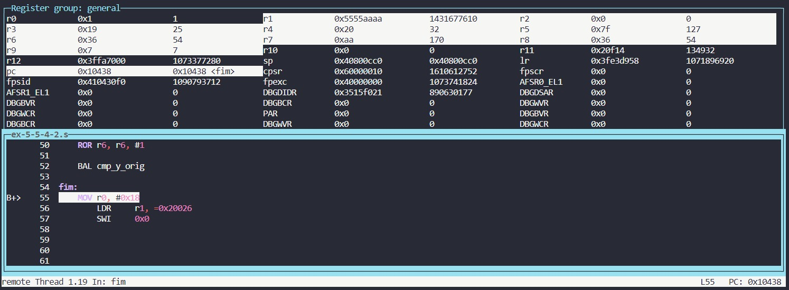

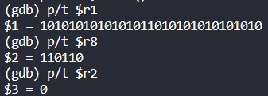

#### 2 - Sequência com 1 bit

Resultado dos registradores após execução:

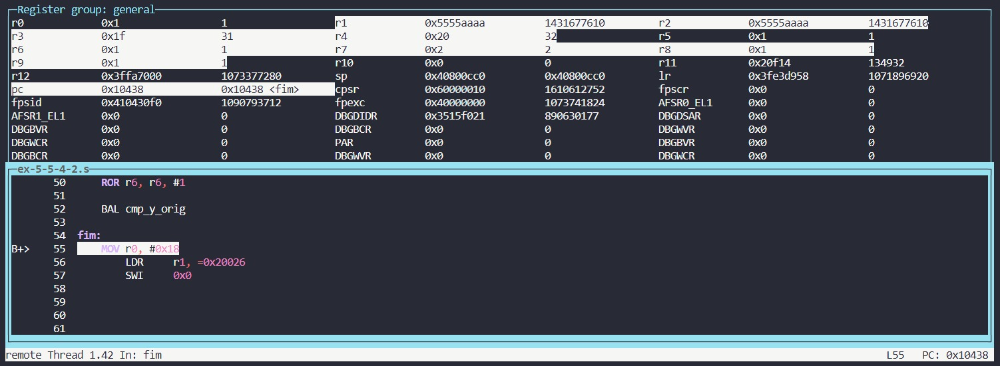

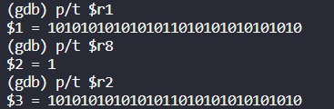

#### 3 - Sequência com 32 bits

Resultado dos registradores após execução:

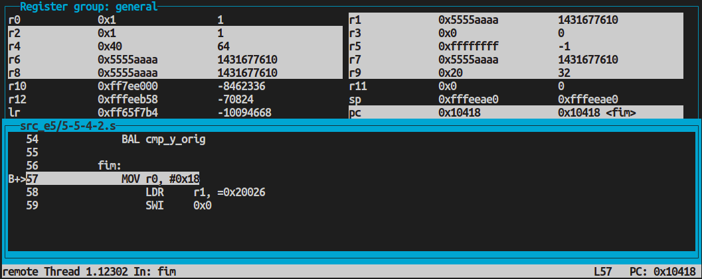

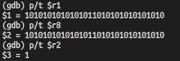

---

### 5.5.5 Sequential parity checker

###### Write ARM assembly to inspect the parity of a value initially held in r0. If r0 has an odd number of ones, the program ends with 0x0001 in r1. If r0 has an even number of ones, the program ends with 0x0000 in r1.

Código utilizado no exercício:

```assembly
@ 5-5-5 parity
.text
.global main
main:
    @ r0: input
    @ r1: result
    @ r2: input copy
    @ r3: counter

    LDR r0, =0x5af00033
    MOV r2, r0
    MOV r3, #0

check_input_0:
    CMP r2, #0
    BEQ input_eq_0

    @ Desloca bits do input para direita uma casa
    LSRS r2, r2, #1
    @ Se bit deslocado era 1 (Carry Set), soma no contador
    ADDCS r3, r3, #1
    BAL check_input_0

input_eq_0:
    @ Quando a copia do input for zero, o contador tera o numero de 1s
    @ Desloca contador para a direita para checar se o bit menos significativo eh 1
    LSRS r3, r3, #1
    @ Caso seja 1, retorna 1 (impar)
    MOVCS r1, #1
    @ Caso seja 0, retorna 0 (par)
    MOVCC r1, #0

fim:
    MOV	r0, #0x18
	LDR	r1, =0x20026
	SWI	0x0

```

Ao executar o código com input <span style='font-family: Courier New, Courier'>0x5af00032</span>, foi observado ao fim da execução r1=1, já que r0 possui um número ímpar de bits 1:

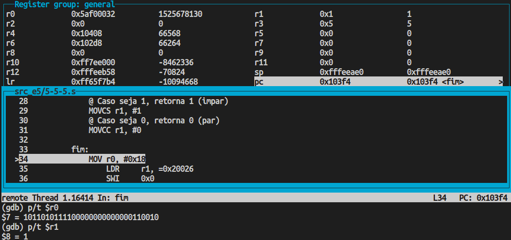

Ja ao executar o código com input <span style='font-family: Courier New, Courier'>0x5af00033</span>, foi observado ao fim da execução r1=0, já que r0 possui um número par de bits 1:

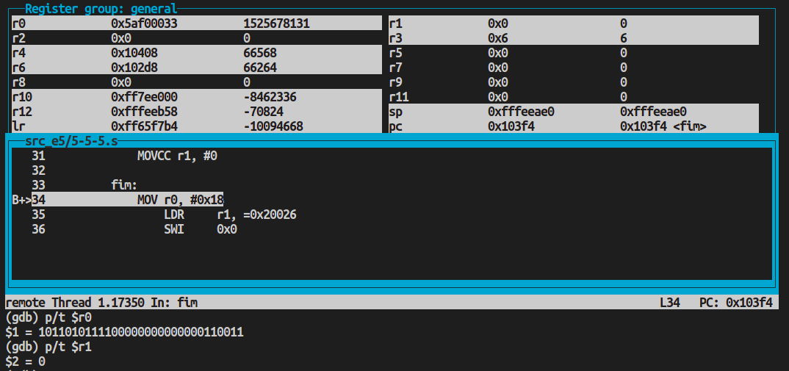
