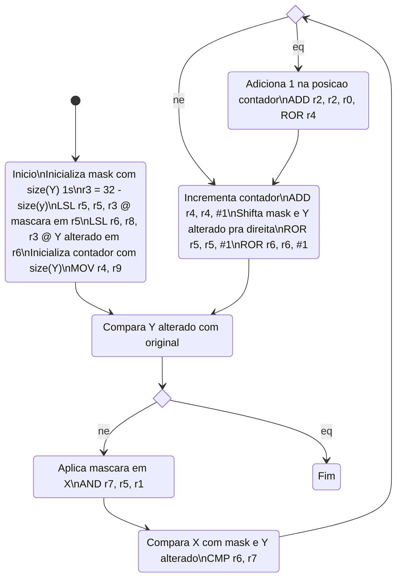

```mermaid
stateDiagram-v2
    state if1 <<choice>>
    state if2 <<choice>>
    Inicio: Inicio\nInicializa mask com size(Y) 1s\nr3 = 32 - size(y)\nLSL r5, r5, r3 @ mascara em r5\nLSL r6, r8, r3 @ Y alterado em r6\nInicializa contador com size(Y)\nMOV r4, r9
    MskX: Aplica mascara em X\nAND r7, r5, r1
    CmpMsk: Compara X com mask e Y alterado\nCMP r6, r7
    Achou: Adiciona 1 na posicao contador\nADD r2, r2, r0, ROR r4
    Increm: Incrementa contador\nADD r4, r4, #1\nShifta mask e Y alterado pra direita\nROR r5, r5, #1\nROR r6, r6, #1
    CmpYcomOrig: Compara Y alterado com original

    [*] --> Inicio
    Inicio --> CmpYcomOrig
    CmpYcomOrig --> if2
    if2 --> MskX : ne
    if2 --> Fim : eq
    MskX --> CmpMsk
    CmpMsk --> if1
    if1 --> Achou : eq
    if1 --> Increm : ne
    Achou --> Increm
    Increm --> CmpYcomOrig
```
