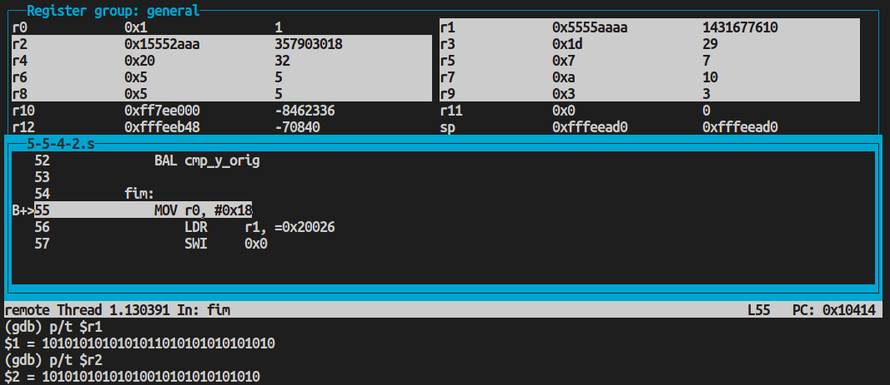

# PCS3432 - Laboratório de Processadores

##### Tarefa - E5

Bruno Mariz - 11261826

---

Algoritmo utilizado:


Código utilizado:

```assembly
@ 5-5-4 2
.text
.global main
main:
    @ r0: cte 1
    @ r1: input X
    @ r2: output Z
    @ r3: aux
    @ r4: contador
    @ r5: mask
    @ r6: Y alterado
    @ r7: X apos mascara
    @ r8: Y (sequencia)
    @ r9: tamanho do Y

    LDR r1, =0x5555aaaa @ X
    MOV r2, #0 @ Z
    MOV r8, #0b101 @ Y
    MOV r9, #3 @ size(Y)
    @ Inicializa Mask
    MOV r5, #0xFFFFFFFF
    RSB r3, r9, #32
    LSL r5, r5, r3
    @ Move bits de Y para bits mais significativos em registrador auxiliar
    LSL r6, r8, r3
    @ Inicializa contador com size(Y)
    MOV r4, r9

cmp_y_orig:
    @ Compara Y alterado com original
    CMP r8, r6
    BEQ fim

    @ Aplica mascara em X
    AND r7, r5, r1

    @ Compara (X com mask) e (Y alterado)
    CMP r6, r7
    BNE incrementa_contador

    @ Adiciona 1 na posicao contador
    ADD r2, r2, r0, ROR r4

incrementa_contador:
    @ Incrementa contador
    ADD r4, r4, #1

    @ Shifta mask e Y alterado para direita
    ROR r5, r5, #1
    ROR r6, r6, #1

    BAL cmp_y_orig

fim:
    MOV	r0, #0x18
	LDR	r1, =0x20026
	SWI	0x0

```

Resultado ao fim da execução:



É possível observar que o resultado em r2 (Z) foi o esperado para a entrada em r1 (X) igual a 0x5555aaaa:

```
(gdb) p/t $r1
$1 = 1010101010101011010101010101010
$2 =   10101010101010010101010101010
```
