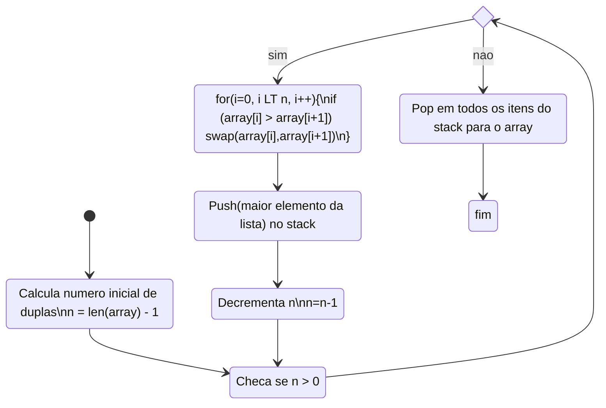

```mermaid
stateDiagram-v2
    state if_state1 <<choice>>
    Inicio: Calcula numero inicial de duplas\nn = len(array) - 1
    LoopTrocas: for(i=0, i LT n, i++){\nif (array[i] > array[i+1]) swap(array[i],array[i+1])\n}
    ChN: Checa se n > 0
    DN: Decrementa n\nn=n-1
    Pel: Push(maior elemento da lista) no stack
    Pop: Pop em todos os itens do stack para o array
    [*] --> Inicio
    Inicio --> ChN
    ChN --> if_state1
    if_state1 --> LoopTrocas: sim
    if_state1 --> Pop: nao
    LoopTrocas --> Pel
    Pel --> DN
    DN --> ChN
    Pop --> fim
```
