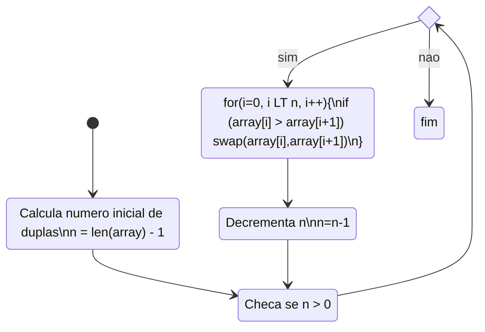

# PCS3432 - Laboratório de Processadores

##### Planejamento - E6

Bruno Mariz - 11261826

---

### 6.1.2 Responda

###### 1 O que há de errado com as seguintes instruções:

###### a) STMIA r5!, {r5, r4, r9}

###### b) LDMDA r2, {}

###### STMDB r15!, {r0-r3, r4, lr}

###### 2 Se o registrador r6 possui 0x8000 (como ponteiro para a memória); após executar

###### LDMIA r6,{r7,r4,r0,lr}

###### o que fica em r0, r4, r7 e em lr?

###### 3 Assuma que a memória e registradores estejam:

| Endereço | Valor      |
| -------- | ---------- |
| 0x8010   | 0x1        |
| 0x800C   | 0xfeeddeaf |
| 0x8008   | 0x00008888 |
| 0x8004   | 0x12340000 |
| 0x8000   | 0xbabe0000 |

###### r0 = 0x13; r1 = 0xffffffff; r2 = 0xeeeeeeee; r3 = 0x8000

###### Descreva a memória e conteúdos dos registradores após a instrução:

###### LDMIA r3!, {r0,r1,r2}

###### 4 Suponha que a pilha esteja como o diagrama abaixo. Qual instrução seria necessária para sair do estado original e ir para o estado a), depois b) e depois c)?

| Endereço | Original   | A          | B           | C          |
| -------- | ---------- | ---------- | ----------- | ---------- |
| 0x8010   | 0x1        | 0x1        | 0x1         | 0x1        |
| 0x800C   | 0xfeeddeaf | 0xfeeddeaf | 0xfeeddeaf  | 0xfeeddeaf |
| 0x8008   |            | 0xbabe2222 | 0xbabe22222 |
| 0x8004   |            |            | 0x12340000  |
| 0x8000   |

### 6.1.3. IMPORTANTE

###### Apresente o código assembly rodando com printscreen de: 6.5.2 Bubble sorting mostrando os dados em ordem crescente, usando comando: x/10d dados

