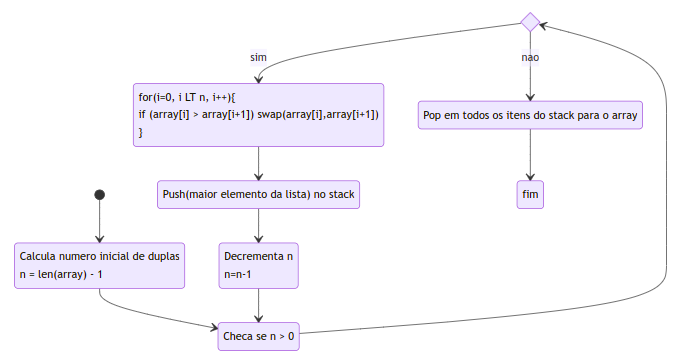
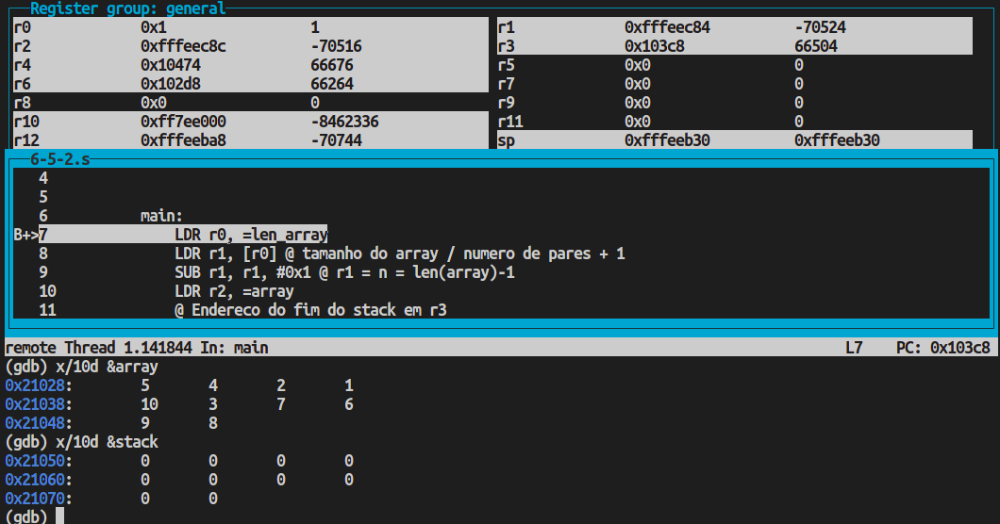
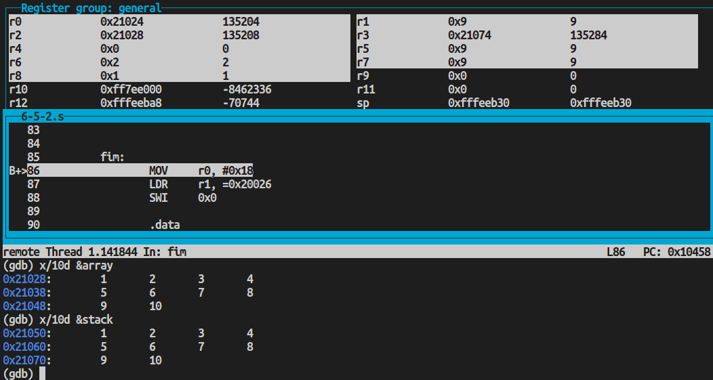

# PCS3432 - Laboratório de Processadores

##### Planejamento - E6

Bruno Mariz - 11261826

---

### 6.1.2 Responda

###### 1 O que há de errado com as seguintes instruções:

###### a) STMIA r5!, \{r5, r4, r9\}

O fato de os registradores não estarem em ordem ascentente não causa erro mas gera warning.

###### b) LDMDA r2, \{}

Lista de registradores vazia.

###### STMDB r15!, \{r0-r3, r4, lr}

Não é permitido utilizar o r15 como base para o stack.

###### 2 Se o registrador r6 possui 0x8000 (como ponteiro para a memória); após executar

###### LDMIA r6, \{r7,r4,r0,lr}

###### o que fica em r0, r4, r7 e em lr?

Os registradores ficarão com as palavras da memória correspondentes aos endereços 0x8000, 0x8004, 0x8008 e 0x800c respectivamente

###### 3 Assuma que a memória e registradores estejam:

| Endereço | Valor      |
| -------- | ---------- |
| 0x8010   | 0x1        |
| 0x800C   | 0xfeeddeaf |
| 0x8008   | 0x00008888 |
| 0x8004   | 0x12340000 |
| 0x8000   | 0xbabe0000 |

###### r0 = 0x13; r1 = 0xffffffff; r2 = 0xeeeeeeee; r3 = 0x8000

###### Descreva a memória e conteúdos dos registradores após a instrução:

###### LDMIA r3!, \{r0,r1,r2}

Memória: igual

Registradores:

r0 = 0xbabe0000

r1 = 0x12340000

r2 = 0x00008888

r3 = 0x800c

###### 4 Suponha que a pilha esteja como o diagrama abaixo. Qual instrução seria necessária para sair do estado original e ir para o estado a), depois b) e depois c)?

| Endereço | Original   | A          | B           | C          |
| -------- | ---------- | ---------- | ----------- | ---------- |
| 0x8010   | 0x1        | 0x1        | 0x1         | 0x1        |
| 0x800C   | 0xfeeddeaf | 0xfeeddeaf | 0xfeeddeaf  | 0xfeeddeaf |
| 0x8008   |            | 0xbabe2222 | 0xbabe22222 |
| 0x8004   |            |            | 0x12340000  |
| 0x8000   |

```
@ Para estado A
STMDB r3!, {r0}
@ Para estado B
STMDB r3!, {r1}
@ Para estado C
LDMIA r3!, {r0, r1}
```

### 6.1.3. IMPORTANTE

###### Apresente o código assembly rodando com printscreen de: 6.5.2 Bubble sorting mostrando os dados em ordem crescente, usando comando: x/10d dados

Código utilizado:

```assembly
@ 6-5-2
	.text
	.globl	main


main:
    LDR r0, =len_array
    LDR r1, [r0] @ tamanho do array / numero de pares + 1
    SUB r1, r1, #0x1 @ r1 = n = len(array)-1
    LDR r2, =array
    @ Endereco do fim do stack em r3
    LDR r3, =stack_end
    BL bubble_sort
    B fim

bubble_sort:
    @ r1: n
    @ r2: array
    @ r3: stack
    @ r4: copy n
    @ r5, r6: itens do array sendo comparados
    @ r7: i
    @ r8: aux

    @ r4 = copy n
    MOV r4, r1

    @ Checa se n>0 (se nao acabaram os pares)
    check_n:
    CMP r4, #0
    STMLEFD r3!, {r8} @ Push no menor elemento apos ultima iteracao
    BLE pop_stack_para_array

    @ for i = 0
    MOV r7, #0
    @ r5 = array[i]
    LDR r5, [r2, r7, LSL #2]
    l_trocas:
    @ i < n
    CMP r7, r4
    BGE exit_trocas
    @ r8 = i + 1
    ADD r8, r7, #1
    @ r6 = array[i+1]
    LDR r6, [r2, r8, LSL #2]
    CMP r5, r6
    @ array[i] = r6
    STRGT r6, [r2, r7, LSL #2]
    @ array[i+1] = r5
    STRGT r5, [r2, r8, LSL #2]
    @ Salva menor elemento para ultima iteracao
    MOVLT r8, r5
    MOVGE r8, r6
    @ r5 = array[i+1] (para proximo loop)
    MOVLT r5, r6
    @ i++
    ADD r7, r7, #1
    BAL l_trocas
    exit_trocas:

    @ n = n - 1
    SUB r4, r4, #1

    @ Push proximo elemento no stack
    STMFD r3!, {r5}

    BAL check_n

    pop_stack_para_array:
    MOV r7, #0 @ for i = 0
    l_pop_stack:
    CMP r7, r1 @ i < n
    BGE exit_l_pop_stack
    @ r5 = pop(stack)
    LDMFD r3!, {r5}
    @ array[i] = r5
    STR r5, [r2, r7, LSL #2]
    @ i++
    ADD r7, r7, #1
    BAL l_pop_stack
    exit_l_pop_stack:
    MOV pc, lr


fim:
	MOV	r0, #0x18
	LDR	r1, =0x20026
	SWI	0x0

	.data
len_array: .word 0xa
array:     .word 5,4,2,1,0xa,3,7,6,9,8
stack: .space 40
stack_end:

```



Estado do array e do stack no inicio do programa:



Estado do array e do stack após execução do programa:


