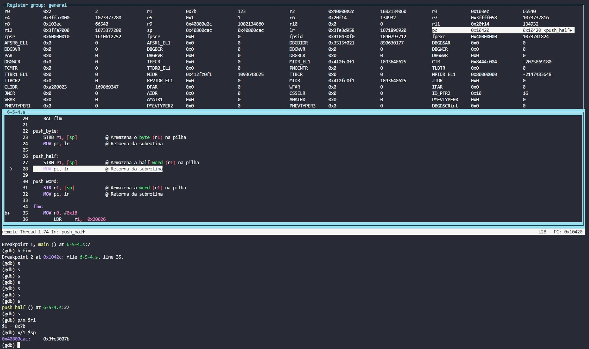

# PCS3432 - Laboratório de Processadores

##### Relatório - E6

| Bancada B8      |          |
| --------------- | -------- |
| Bruno Mariz     | 11261826 |
| Roberta Andrade | 11260832 |

---

### 6.5.1 Transmission of arguments

###### Write ARM assembly code to compute the function a = b × c + d. Write three separate programs that:

###### • transmit the arguments by way of registers with one subroutine, func1

```
@ r1 = a
@ r2 = b
@ r3 = c
@ r4 = d
@ r5 = arguments address

	.text
	.global main

main:
	LDR		r5, =dados
	LDMIA	r5, {r2-r4}

	BL		func1

fim:
	SWI		0x0

func1:
	MUL		r1, r2, r3
	ADD		r1, r1, r4

	MOV		pc, lr

dados:		.word 1, 4, 5
```

###### • transmit the arguments by way of the addresses with one subroutine, func1

```
@ r1 = a
@ r2 = b
@ r3 = c
@ r4 = d
@ r5 = arguments address

	.text
	.global main

main:
	LDR		r5, =dados

	BL		func1

fim:
	SWI		0x0

func1:
	LDMIA	r5, {r2-r4}

	MUL		r1, r2, r3
	ADD		r1, r1, r4

	MOV		pc, lr

dados:		.word 1, 4, 5
```

###### • transmit the arguments by way of the stack with two subroutines, func1 and func2, that demonstrate stack functionality.

```
@ r1 = a
@ r2 = b
@ r3 = c
@ r4 = d
@ r5 = arguments address

	.text
	.global main

main:
	LDR		r5, =dados
	LDMIA	r5, {r2-r4}

	STMFD 	sp!, {r2-r4} @ Push onto a full descending stack

	BL		func1

fim:
	SWI		0x0

func1:
	LDMFD 	sp!, {r2-r4} @ Pop from a full descending stack

	STMFD 	sp!, {lr} @ Push onto a full descending stack
	BL		func2
	LDMFD 	sp!, {lr} @ Pop from a full descending stack

	MOV		pc, lr

func2:
	MUL		r1, r2, r3
	ADD		r1, r1, r4

	MOV		pc, lr

dados:		.word 1, 4, 5
```

---

### 6.5.2 Bubble sorting

###### 1. Write ARM assembly code to perform an ascending bubble sort operation on a list located in memory. The length of the list is located at 0x4000 and the first element of the list is located at 0x4001. The sorted list must be stored back to the original array of memory locations starting at 0x4001. Assume an array of bytes.

###### 2. Modify your code to utilize a full descending stack. Sorting must be done on the stack only. Once the stack is sorted, store the sorted stack back to the original array of memory locations starting at 0x4001. The algorithm for the bubble sort is as follows:

###### a. Compare adjacent elements. If the first element is greater than the second, swap them.

###### b. Do this for each pair of adjacent elements, starting with the first two and ending with the last two. At this point the last element should be the greatest.

###### c. Repeat the steps for all elements except the last one.

###### d. Repeat this process for one fewer element each time, until you have no more pairs to compare.

Código utilizado:

```assembly
	.text
	.globl	main


main:
    LDR r0, =len_array
    LDR r1, [r0] @ tamanho do array / numero de pares + 1
    SUB r1, r1, #0x1 @ r1 = n = len(array)-1
    LDR r2, =array
    @ Endereco do fim do stack em r3
    LDR r3, =stack_end
    BL bubble_sort
    B fim

bubble_sort:
    @ r1: n
    @ r2: array
    @ r3: stack
    @ r4: copy n
    @ r5, r6: itens do array sendo comparados
    @ r7: i
    @ r8: aux

    @ r4 = copy n
    MOV r4, r1

    @ Checa se n>0 (se nao acabaram os pares)
    check_n:
    CMP r4, #0
    STMLEFD r3!, {r8} @ Push no menor elemento apos ultima iteracao
    BLE pop_stack_para_array

    @ for i = 0
    MOV r7, #0
    @ r5 = array[i]
    LDR r5, [r2, r7, LSL #2]
    l_trocas:
    @ i < n
    CMP r7, r4
    BGE exit_trocas
    @ r8 = i + 1
    ADD r8, r7, #1
    @ r6 = array[i+1]
    LDR r6, [r2, r8, LSL #2]
    CMP r5, r6
    @ array[i] = r6
    STRGT r6, [r2, r7, LSL #2]
    @ array[i+1] = r5
    STRGT r5, [r2, r8, LSL #2]
    @ Salva menor elemento para ultima iteracao
    MOVLT r8, r5
    MOVGE r8, r6
    @ r5 = array[i+1] (para proximo loop)
    MOVLT r5, r6
    @ i++
    ADD r7, r7, #1
    BAL l_trocas
    exit_trocas:

    @ n = n - 1
    SUB r4, r4, #1

    @ Push proximo elemento no stack
    STMFD r3!, {r5}

    BAL check_n

    pop_stack_para_array:
    MOV r7, #0 @ for i = 0
    l_pop_stack:
    CMP r7, r1 @ i < n
    BGE exit_l_pop_stack
    @ r5 = pop(stack)
    LDMFD r3!, {r5}
    @ array[i] = r5
    STR r5, [r2, r7, LSL #2]
    @ i++
    ADD r7, r7, #1
    BAL l_pop_stack
    exit_l_pop_stack:
    MOV pc, lr


fim:
	MOV	r0, #0x18
	LDR	r1, =0x20026
	SWI	0x0

	.data
len_array: .word 0xa
array:     .word 5,4,2,1,0xa,3,7,6,9,8
stack: .space 40
stack_end:

```

Registradores após inicializar r0 e r1:


No fim do código o valor de r1 foi armazenado e pode ser acessado pelo sp:



---

### 6.5.3 Magic squares

###### Write ARM assembly to check whether an N × N matrix is a magic square. A magic square is an N × N matrix in which the sum of the numbers in every row, column, or diagonal is N(N2 + 1)/2. All matrix entries are unique numbers from 1 to N2. For example, suppose you wanted to test a famous example of a magic square:

|     |     |     |     |
| --- | --- | --- | --- |
| 16  | 3   | 2   | 13  |
| 5   | 10  | 11  | 8   |
| 9   | 6   | 7   | 12  |
| 4   | 15  | 14  | 1   |

###### The matrix starts at location 0x4000 and ends at location (0x4000 + N2). Put the 16 in location 0x4000, 3 in 0x4001, 2 in 0x4002, 13 in 0x4003, 5 in 0x4004, …, and 1 in 0x400F. Put N in r1. Assume that everything is in bytes, which puts a constraint on N. Write the code so that, if the matrix is a magic square, r9 is set, and otherwise it is cleared. To test the algorithm, you can search the Internet for other magic square examples, such as Ben Franklin's own 8 × 8 magic square.

Código utilizado:

```assembly
	.text
	.globl	main


main:
    @ r1: N
    @ r2: quadrado
    @ r3: valor de teste N(N^2+1)/2
    @ r4: aux
    @ r5: array_teste
    @ r6: aux
    @ r7: contador
    @ r8: contador
    @ r9: resultado
    @ r10: aux

    @ Inicializacoes
    MOV r9, #1
    MOV r7, #0
    MOV r8, #0
    LDR r4, =N
    LDRB r1, [r4]
    LDR r2, =quadrado
    @ Calcula valor de teste do quadrado
    MUL r4, r1, r1
    ADD r4, r4, #1
    MUL r3, r4, r1
    MOV r3, r3, LSR #1
    LDR r5, =array_teste

    BL teste_unicidade
    CMP r9, #0
    BEQ fim

    BL teste_lin_col
    CMP r9, #0
    BEQ fim

    BL teste_diag_1
    CMP r9, #0
    BEQ fim

    BL teste_diag_2

    @ Salva resultado em ehmagico
    LDR r10, =ehmagico
    STRB r9, [r10]

    BAL fim

teste_unicidade:
    @ Calcula N^2
    MUL r10, r1, r1
    MOV r7, #0 @ for i = 0
    loop_teste_unicidade:
    CMP r7, r10 @ i < N^2
    BGE exit_loop_teste_unicidade
    @ Busca quadrado[i]
    LDRB r4, [r2, r7]
    SUB r4, r4, #1
    @ Busca array_teste[r4]
    LDRB r6, [r5, r4]
    @ Ve se eh zero
    CMP r6, #0
    @ Se nao for zero (numero repetido) retorna 0
    MOVNE r9, #0
    MOVNE pc, lr
    @ Se for zero, troca para 1
    MOV r6, #1
    @ array_teste[r4] = 1
    STREQB r6, [r5, r4]
    @ i++
    ADD r7, r7, #1
    BAL loop_teste_unicidade
    exit_loop_teste_unicidade:

    MOV pc, lr

teste_lin_col:

    MOV r7, #0 @ for k = 0
    loop_lin_col:
    CMP r7, r1 @ k < N
    BGE exit_loop_lin_col

        @ Testa linha
        MOV r10, #0
        MOV r8, #0 @ for j=0
        loop_lin:
        CMP r8, r1 @ j < N
        BGE exit_loop_lin
        @ Calcula k*N
        MUL r4, r7, r1
        @ Calcula k*N + j
        ADD r4, r4, r8
        @ r6 = quadrado[k*N + j]
        LDRB r6, [r2, r4]
        @ Soma o acumulado em r10
        ADD r10, r10, r6
        ADD r8, r8, #1 @ j++
        BAL loop_lin
        exit_loop_lin:

        @ Se soma da linha nao for igual a N(N^2+1)/2, retorna 0
        CMP r10, r3
        MOVNE r9, #0
        MOVNE pc, lr

        @ Testa coluna
        MOV r10, #0
        MOV r8, #0 @ for i=0
        loop_col:
        CMP r8, r1 @ i < N
        BGE exit_loop_col
        @ Calcula i*N
        MUL r4, r8, r1
        @ Calcula i*N + k
        ADD r4, r4, r7
        @ r6 = quadrado[i*N + k]
        LDRB r6, [r2, r4]
        @ Soma o acumulado em r10
        ADD r10, r10, r6
        ADD r8, r8, #1 @ i++
        BAL loop_col
        exit_loop_col:

        @ Se soma da coluna nao for igual a N(N^2+1)/2, retorna 0
        CMP r10, r3
        MOVNE r9, #0
        MOVNE pc, lr

    @ k++
    ADD r7, r7, #1
    BAL loop_lin_col
    exit_loop_lin_col:

    MOV pc, lr

teste_diag_1:
    @ Testa diagonal principal
    MOV r10, #0
    MOV r8, #0 @ for i=0
    loop_diagonal_principal:
    CMP r8, r1 @ i < N
    BGE exit_loop_diagonal_principal
    @ Calcula i*N
    MUL r4, r8, r1
    @ Calcula posicao [i][i] com i*N + i
    ADD r4, r4, r8
    @ r6 = quadrado[i*N + i]
    LDRB r6, [r2, r4]
    @ Soma o acumulado em r10
    ADD r10, r10, r6
    ADD r8, r8, #1 @ i++
    BAL loop_diagonal_principal
    exit_loop_diagonal_principal:

    @ Se soma da diagonal nao for igual a N(N^2+1)/2, retorna 0
    CMP r10, r3
    MOVNE r9, #0
    MOV pc, lr

teste_diag_2:
    @ Testa diagonal secundaria
    MOV r10, #0
    MOV r8, #0 @ for i=0
    loop_diagonal_secundaria:
    CMP r8, r1 @ i < N
    BGE exit_loop_diagonal_secundaria
    @ Calcula i*N
    MUL r4, r8, r1
    @ Calcula posicao [i][N-i] com i*N + (N-i-1)
    ADD r4, r4, r1
    SUB r4, r4, r8
    SUB r4, r4, #1
    @ r6 = quadrado[i*N + (N-i-1)]
    LDRB r6, [r2, r4]
    @ Soma o acumulado em r10
    ADD r10, r10, r6
    ADD r8, r8, #1 @ i++
    BAL loop_diagonal_secundaria
    exit_loop_diagonal_secundaria:

    @ Se soma da diagonal nao for igual a N(N^2+1)/2, retorna 0
    CMP r10, r3
    MOVNE r9, #0

    MOV pc, lr

fim:
	MOV	r0, #0x18
	LDR	r1, =0x20026
	SWI	0x0

	.data
ehmagico: .space 4
@ N: .byte 4
@ quadrado: .byte 16,3,2,13,5,10,11,8,9,6,7,12,4,15,14,1
N: .byte 3
quadrado: .byte 5,5,5,5,5,5,5,5,5
array_teste: .space 100 @ algoritmo funciona para quadrados de N ate 100
```

O código funcionou como esperado, identificando corretamente os "quadrados mágicos" nos testes realizados.


---

### 6.5.4 More stacks

###### Write ARM assembly to implement a push operation without the use of load/store multiple instructions. Write the code to handle bytes, half-words, and words. Use r0 to indicate the data type. A value of 1 in r0 indicates that a byte is to be pushed, 2 indicates a half-word, and 4 indicates a word. Put the data to push in r1.

Código utilizado:

```assembly
    .text
    .globl main

main:
    MOV r1, #10             @ Inicializa r1 com o valor 10 (valor a ser empilhado)
    MOV r0, #2              @ Inicializa r0 para indicar o tipo
    SUB sp, sp, #4          @ Decrementa o ponteiro de pilha (sp) em 4 bytes

    CMP r0, #1              @ Verifica se é do tipo byte (r0 = 1)
    BEQ push_byte           @ Se é byte, chama a subrotina "push_byte"

    CMP r0, #2              @ Verifica se é do tipo half-word (r0 = 2)
    BEQ push_half           @ Se é half-word, chama a subrotina "push_half"

    CMP r0, #4              @ Verifica se é do tipo word (r0 = 4)
    BEQ push_word           @ Se é half-word, chama a subrotina "push_word"

    BAL fim

push_byte:
    STRB r1, [sp]           @ Armazena o byte (r1) na pilha
    MOV pc, lr              @ Retorna da subrotina

push_half:
    STRH r1, [sp]           @ Armazena a half-word (r1) na pilha
    MOV pc, lr              @ Retorna da subrotina

push_word:
    STR r1, [sp]            @ Armazena a word (r1) na pilha
    MOV pc, lr              @ Retorna da subrotina

fim:
    MOV	r0, #0x18
    LDR	r1, =0x20026
    SWI	0x0
```

Ao fim da execução, foi possível observar que o valor de teste do tipo "half-word" foi armazenado na memória assim como esperado.
