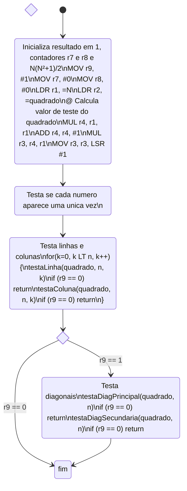

```mermaid
stateDiagram-v2
    state if_state1 <<choice>>
    state if_state2 <<choice>>
    Inicio: Inicializa resultado em 1, contadores r7 e r8 e N(N²+1)/2\nMOV r9, #1\nMOV r7, #0\nMOV r8, #0\nLDR r1, =N\nLDR r2, =quadrado\n@ Calcula valor de teste do quadrado\nMUL r4, r1, r1\nADD r4, r4, #1\nMUL r3, r4, r1\nMOV r3, r3, LSR #1
    TestaUnico: Testa se cada numero aparece uma unica vez\n
    LoopLinhasCol: Testa linhas e colunas\nfor(k=0, k LT n, k++){\ntestaLinha(quadrado, n, k)\nif (r9 == 0) return\ntestaColuna(quadrado, n, k)\nif (r9 == 0) return\n}
    TestaDiag: Testa diagonais\ntestaDiagPrincipal(quadrado, n)\nif (r9 == 0) return\ntestaDiagSecundaria(quadrado, n)\nif (r9 == 0) return
    [*] --> Inicio
    Inicio --> TestaUnico
    TestaUnico --> LoopLinhasCol
    LoopLinhasCol --> if_state1
    if_state1 --> TestaDiag: r9 == 1
    if_state1 --> fim: r9 == 0
    TestaDiag --> fim
```
