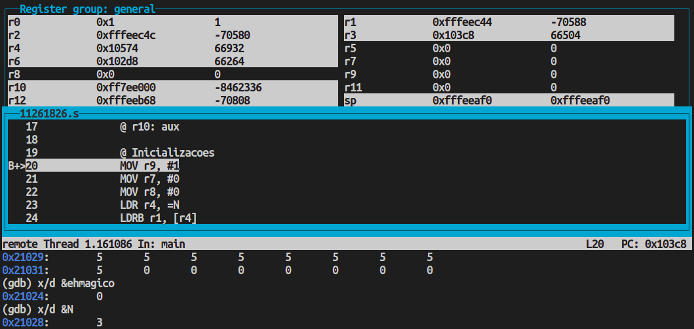
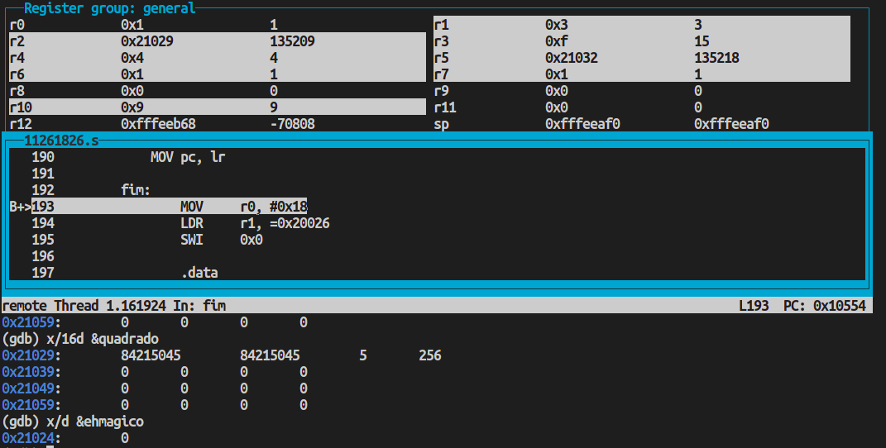
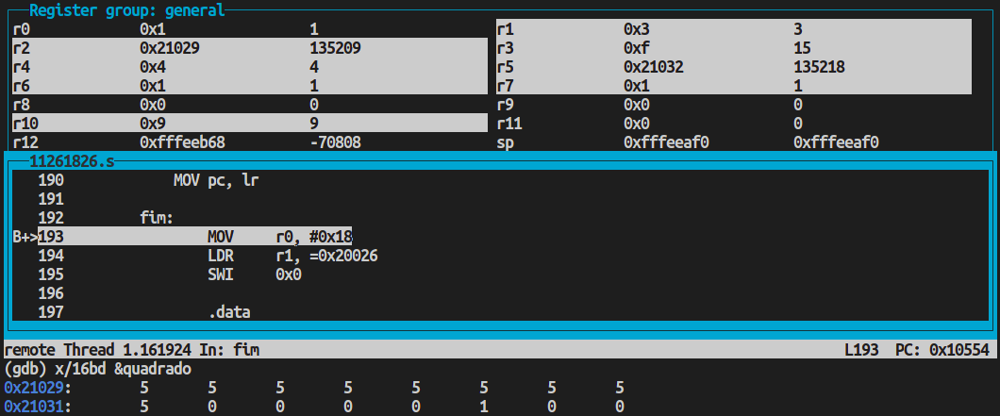

# PCS3432 - Laboratório de Processadores

##### Tarefa - E6

Bruno Mariz - 11261826

---

### 6.5.3 - Magic squares

###### Write ARM assembly to check whether an N × N matrix is a magic square. A magic square is an N × N matrix in which the sum of the numbers in every row, column, or diagonal is N(N2 + 1)/2. All matrix entries are unique numbers from 1 to N2. For example, suppose you wanted to test a famous example of a magic square:

|     |     |     |     |
| --- | --- | --- | --- |
| 16  | 3   | 2   | 13  |
| 5   | 10  | 11  | 8   |
| 9   | 6   | 7   | 12  |
| 4   | 15  | 14  | 1   |

###### The matrix starts at location 0x4000 and ends at location (0x4000 + N2). Put the 16 in location 0x4000, 3 in 0x4001, 2 in 0x4002, 13 in 0x4003, 5 in 0x4004, …, and 1 in 0x400F. Put N in r1. Assume that everything is in bytes, which puts a constraint on N. Write the code so that, if the matrix is a magic square, r9 is set, and otherwise it is cleared. To test the algorithm, you can search the Internet for other magic square examples, such as Ben Franklin's own 8 × 8 magic square.

Código utilizado no exercício:

```assembly

@ 6-5-3 Magic Squares
	.text
	.globl	main


main:
    @ r1: N
    @ r2: quadrado
    @ r3: valor de teste N(N^2+1)/2
    @ r4: aux
    @ r5: array_teste
    @ r6: aux
    @ r7: contador
    @ r8: contador
    @ r9: resultado
    @ r10: aux

    @ Inicializacoes
    MOV r9, #1
    MOV r7, #0
    MOV r8, #0
    LDR r4, =N
    LDRB r1, [r4]
    LDR r2, =quadrado
    @ Calcula valor de teste do quadrado
    MUL r4, r1, r1
    ADD r4, r4, #1
    MUL r3, r4, r1
    MOV r3, r3, LSR #1
    LDR r5, =array_teste

    BL teste_unicidade
    CMP r9, #0
    BEQ fim

    BL teste_lin_col
    CMP r9, #0
    BEQ fim

    BL teste_diag_1
    CMP r9, #0
    BEQ fim

    BL teste_diag_2

    @ Salva resultado em ehmagico
    LDR r10, =ehmagico
    STRB r9, [r10]

    BAL fim

teste_unicidade:
    @ Calcula N^2
    MUL r10, r1, r1
    MOV r7, #0 @ for i = 0
    loop_teste_unicidade:
    CMP r7, r10 @ i < N^2
    BGE exit_loop_teste_unicidade
    @ Busca quadrado[i]
    LDRB r4, [r2, r7]
    SUB r4, r4, #1
    @ Busca array_teste[r4]
    LDRB r6, [r5, r4]
    @ Ve se eh zero
    CMP r6, #0
    @ Se nao for zero (numero repetido) retorna 0
    MOVNE r9, #0
    MOVNE pc, lr
    @ Se for zero, troca para 1
    MOV r6, #1
    @ array_teste[r4] = 1
    STREQB r6, [r5, r4]
    @ i++
    ADD r7, r7, #1
    BAL loop_teste_unicidade
    exit_loop_teste_unicidade:

    MOV pc, lr

teste_lin_col:

    MOV r7, #0 @ for k = 0
    loop_lin_col:
    CMP r7, r1 @ k < N
    BGE exit_loop_lin_col

        @ Testa linha
        MOV r10, #0
        MOV r8, #0 @ for j=0
        loop_lin:
        CMP r8, r1 @ j < N
        BGE exit_loop_lin
        @ Calcula k*N
        MUL r4, r7, r1
        @ Calcula k*N + j
        ADD r4, r4, r8
        @ r6 = quadrado[k*N + j]
        LDRB r6, [r2, r4]
        @ Soma o acumulado em r10
        ADD r10, r10, r6
        ADD r8, r8, #1 @ j++
        BAL loop_lin
        exit_loop_lin:

        @ Se soma da linha nao for igual a N(N^2+1)/2, retorna 0
        CMP r10, r3
        MOVNE r9, #0
        MOVNE pc, lr

        @ Testa coluna
        MOV r10, #0
        MOV r8, #0 @ for i=0
        loop_col:
        CMP r8, r1 @ i < N
        BGE exit_loop_col
        @ Calcula i*N
        MUL r4, r8, r1
        @ Calcula i*N + k
        ADD r4, r4, r7
        @ r6 = quadrado[i*N + k]
        LDRB r6, [r2, r4]
        @ Soma o acumulado em r10
        ADD r10, r10, r6
        ADD r8, r8, #1 @ i++
        BAL loop_col
        exit_loop_col:

        @ Se soma da coluna nao for igual a N(N^2+1)/2, retorna 0
        CMP r10, r3
        MOVNE r9, #0
        MOVNE pc, lr

    @ k++
    ADD r7, r7, #1
    BAL loop_lin_col
    exit_loop_lin_col:

    MOV pc, lr

teste_diag_1:
    @ Testa diagonal principal
    MOV r10, #0
    MOV r8, #0 @ for i=0
    loop_diagonal_principal:
    CMP r8, r1 @ i < N
    BGE exit_loop_diagonal_principal
    @ Calcula i*N
    MUL r4, r8, r1
    @ Calcula posicao [i][i] com i*N + i
    ADD r4, r4, r8
    @ r6 = quadrado[i*N + i]
    LDRB r6, [r2, r4]
    @ Soma o acumulado em r10
    ADD r10, r10, r6
    ADD r8, r8, #1 @ i++
    BAL loop_diagonal_principal
    exit_loop_diagonal_principal:

    @ Se soma da diagonal nao for igual a N(N^2+1)/2, retorna 0
    CMP r10, r3
    MOVNE r9, #0
    MOV pc, lr

teste_diag_2:
    @ Testa diagonal secundaria
    MOV r10, #0
    MOV r8, #0 @ for i=0
    loop_diagonal_secundaria:
    CMP r8, r1 @ i < N
    BGE exit_loop_diagonal_secundaria
    @ Calcula i*N
    MUL r4, r8, r1
    @ Calcula posicao [i][N-i] com i*N + (N-i-1)
    ADD r4, r4, r1
    SUB r4, r4, r8
    SUB r4, r4, #1
    @ r6 = quadrado[i*N + (N-i-1)]
    LDRB r6, [r2, r4]
    @ Soma o acumulado em r10
    ADD r10, r10, r6
    ADD r8, r8, #1 @ i++
    BAL loop_diagonal_secundaria
    exit_loop_diagonal_secundaria:

    @ Se soma da diagonal nao for igual a N(N^2+1)/2, retorna 0
    CMP r10, r3
    MOVNE r9, #0

    MOV pc, lr

fim:
	MOV	r0, #0x18
	LDR	r1, =0x20026
	SWI	0x0

	.data
ehmagico: .space 4
N: .byte 3
quadrado: .byte 5,5,5,5,5,5,5,5,5
array_teste: .space 100 @ algoritmo funciona para quadrados de N ate 100
```

No inicio da execução, o estado dos registradores e valores de memória são:

```
x/16bd &quadrado
x/d &ehmagico
x/d &N
```



Após executar todos os comandos do enunciado, os resultados observados foram:

```
b main
c
# breakpoint no SWI
b fim
c
# para quadrado 4x4
x/16d &quadrado
# 1- magico 0 - nao eh magico
x/d &ehmagico
```



```
# printando em bytes
x/16bd &quadrado
```


