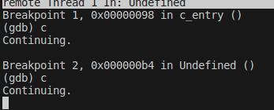

# PCS3432 - Laboratório de Processadores

##### Relatório - E9

| Bancada B8      |          |
| --------------- | -------- |
| Bruno Mariz     | 11261826 |
| Roberta Andrade | 11260832 |

---

### 9-2-1

Os códigos foram compilados e linkados utilizando os comandos abaixo, e em seguida foi utilizado o GDB em um terminal separado para adicionar o breakpoint e executar o programa.

### 9-2-2

Foram compilados os códigos conforme indicado no enunciado, e então foi utilizado o GDB para executar o programa.

Ao rodar o comando de print na imagem acima, foi observada a saída "Hello, world!" no outro terminal, que pode ser observada na imagem abaixo:

### 9-2-3

Ao executar o código, foram executadas as funções Reset_Handler, primeiramente, que fez com que "Hello world!" fosse printado no terminal:

Após o segundo comando "continue", foi executada a instrução inválida, o que fez o programa saltar para a subrotina Undefined_Handler, que por sua vez chamou a função Undefined, que printou "instrução inválida!" no terminal:

### 9-2-4

Ao rodar o código, o programa vai para o Reset_Handler, que chama a função c_entry. Nesse momento, o modo do processador está em Supervisor (0b10011 nos ultimos 5 bits do CPSR):

