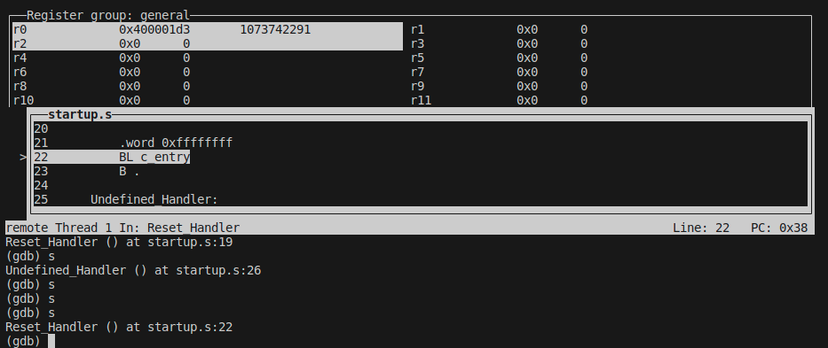
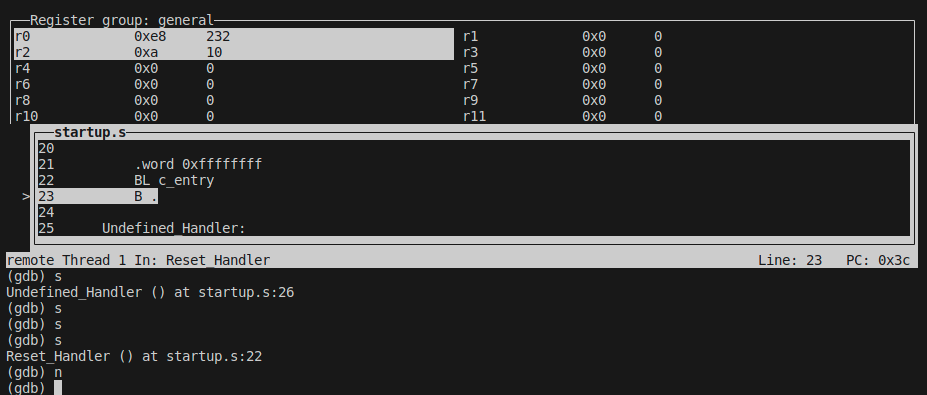

# PCS3432 - Laboratório de Processadores

##### Relatório - E9

| Bancada B8      |          |
| --------------- | -------- |
| Bruno Mariz     | 11261826 |
| Roberta Andrade | 11260832 |

---

### 9-2-1

Os códigos foram compilados e linkados utilizando os comandos abaixo, e em seguida foi utilizado o GDB em um terminal separado para adicionar o breakpoint e executar o programa.


### 9-2-2

Foram compilados os códigos conforme indicado no enunciado, e então foi utilizado o GDB para executar o programa.


Ao rodar o comando de print na imagem acima, foi observada a saída "Hello, world!" no outro terminal, que pode ser observada na imagem abaixo:


### 9-2-3


Ao executar o código, foram executadas as funções Reset_Handler, primeiramente, que fez com que "Hello world!" fosse printado no terminal:


Após o segundo comando "continue", foi executada a instrução inválida, o que fez o programa saltar para a subrotina Undefined_Handler, que por sua vez chamou a função Undefined, que printou "instrução inválida!" no terminal:


### 9-2-4

Ao rodar o código, o programa vai para o Reset_Handler, que chama a função c_entry. Nesse momento, o modo do processador está em Supervisor (0b10011 nos ultimos 5 bits do CPSR):


Após executar a instrução indefinida do Reset_Handler, o programa pula para a subrotina Undefined_Handler, e é possível observar que o modo do processador nesse momento está em Undefined (0b11011):


O programa então entra em loop infinito e permanece nesse modo.

### 9-2-5

Foi executado o código utilizando o gdb e foi possível observar o registrador CPSR salvo em r0:


A mudança de modo, e o SP_undef com o valor 0x0:


A alteração do valor de SP_undef para 0x2000:


A saída do modo Undefined e o valor de SP_svc em 0x1000:


Continuando o programa, é possível observar o comportamento esperado após encontrar a instrução inválida do Reset_Handler:


### 9-2-6

Código utilizado na questão:

```
.section INTERRUPT_VECTOR, "x"
.global _Reset
_Reset:
  B Reset_Handler /* Reset */
  B Undefined_Handler /* Undefined */
  B . /* SWI */
  B . /* Prefetch Abort */
  B . /* Data Abort */
  B . /* reserved */
  B . /* IRQ */
  B . /* FIQ */
 
Reset_Handler:
    LDR sp, =svc_stack_top

    MRS r0, cpsr    /*  salvando o modo corrente em R0*/
    MSR cpsr_ctl, #0b11011011 /*  alterando o modo para undefined - o SP é automaticamente chaveado ao chavear o modo*/
    LDR sp, =undefined_stack_top /*  a pilha de undefined é setada */
    MSR cpsr, r0 /*  volta para o modo anterior */

    .word 0xffffffff
    BL c_entry
    B .

Undefined_Handler:
    STMFD sp!, {r0-r12,lr}
    BL Undefined
vesaida:
    LDMFD sp!, {r0-r12,pc}^
```

Ao executar o programa acima, e foram feitos os prints em cada etapa, observando ao fim que a função Undefined foi executada e depois o código retornou ao ponto onde estava em Reset_Handler, onde foi chamado c_entry:







###### a) Por que tem um chapeuzinho "^" no final da instrução? Para que serve isso?

O acento circunflexo no fim da instrução serve para que o registrador de status seja carregado com o status salvo simultaneamente.

###### b) Por que essa instrução não salva os registradores sp (ou r13) e r14?

O sp não é salvo pela instrução pois ele é usado como registrador de base para apontar para a pilha, e o r14 (LR) não é salvo pois seu valor não precisa ser recuperado, mas sim transferido para o PC, ou seja, em vez de inserir LR na lista de registradores, é inserido PC, colocando assim o valor antigo do LR em PC e retornando ao ponto do programa onde foi encontrada a instrução indefinida.

###### c) O sp do modo Undefined já deve ter sido inicializado logo no reset, quando a placa é inicializada usando a instrução MSR para chavear o modo e inicializar o sp.

Isso se deve à necessidade de se manter o valor de SP_undef entre diferentes chamadas de Undefined_Handler, o que não seria possível se SP_undef fosse reinicializado dentro de Undefined_Handler toda vez que a subrotina fosse chamada.
 