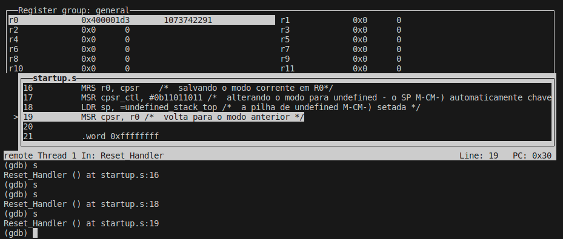
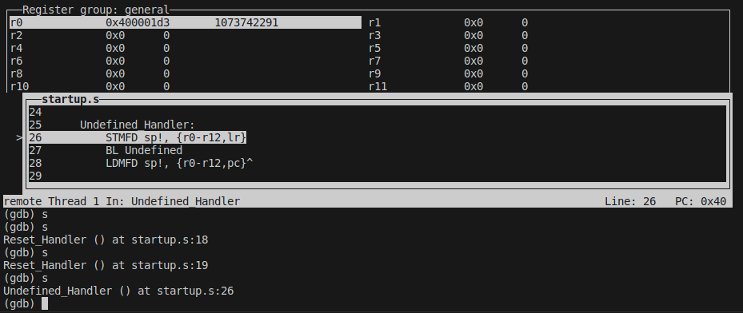
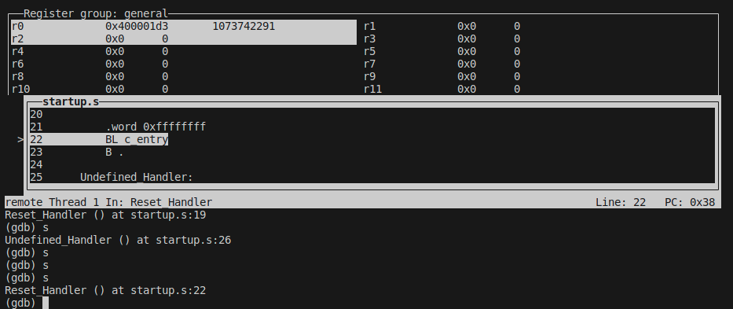
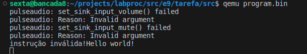
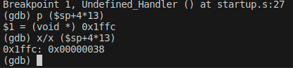
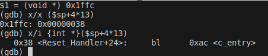

Foi gerado o programa de startup:

```
.section INTERRUPT_VECTOR, "x"
.global _Reset
_Reset:
  B Reset_Handler /* Reset */
  B Undefined_Handler /* Undefined */
  B . /* SWI */
  B . /* Prefetch Abort */
  B . /* Data Abort */
  B . /* reserved */
  B . /* IRQ */
  B . /* FIQ */
 
Reset_Handler:
    LDR sp, =svc_stack_top

    MRS r0, cpsr    /*  salvando o modo corrente em R0*/
    MSR cpsr_ctl, #0b11011011 /*  alterando o modo para undefined - o SP é automaticamente chaveado ao chavear o modo*/
    LDR sp, =undefined_stack_top /*  a pilha de undefined é setada */
    MSR cpsr, r0 /*  volta para o modo anterior */

    .word 0xffffffff
    BL c_entry
    B .

Undefined_Handler:
    STMFD sp!, {r0-r12,lr}
    BL Undefined
vesaida:
    LDMFD sp!, {r0-r12,pc}^

```

Inicialmente foi executado o programa acima, e foram feitos os prints em cada etapa, observando ao fim que a função Undefined foi executada e depois o código retornou ao ponto onde estava em Reset_Handler, onde foi chamado c_entry:










Parando o programa antes da instrução em vesaida, foram feitos os prints a seguir:





Isso é o esperado, pois a próxima instrução a ser executada ao sair de Undefined_Handler é o branch para c_entry.