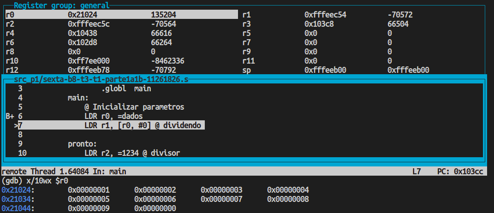
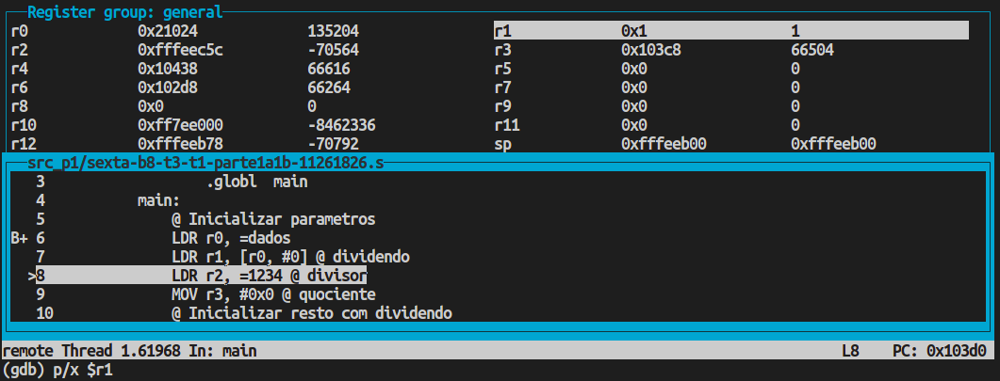
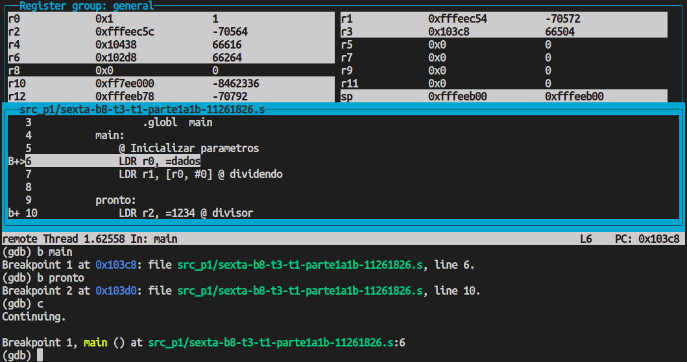
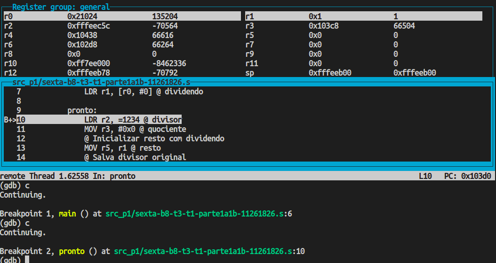
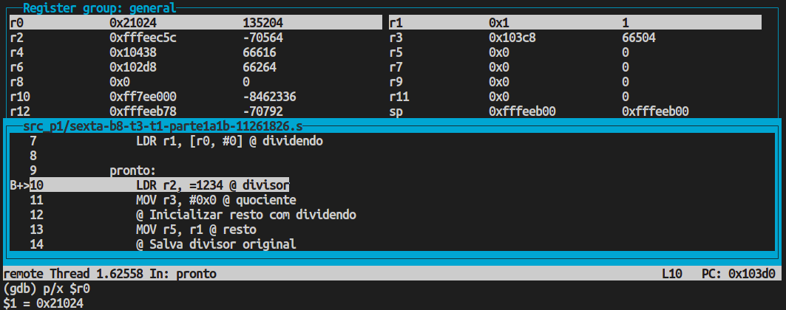
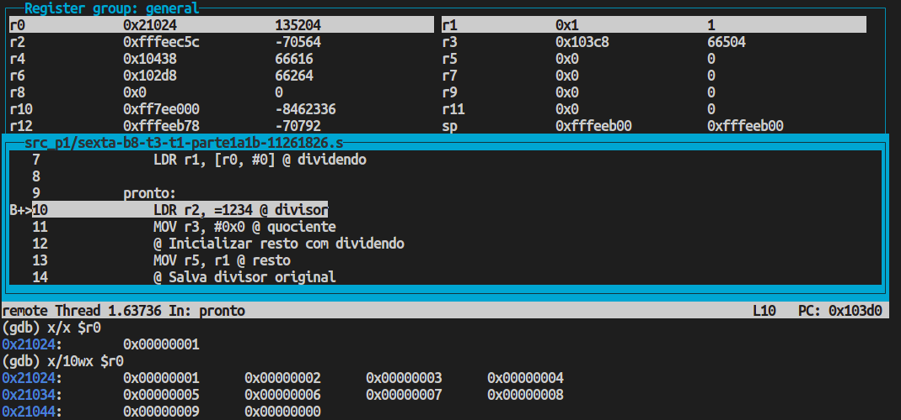

# PCS3432 - Laboratório de Processadores - Primeira Prova - 12/05/2.023

|              |             |            |           |
| ------------ | ----------- | ---------- | --------- |
| **Aluno:**   | Bruno Mariz | **N USP:** | 11261826; |
| **Turma:**   | 3 (Sexta);  | **Turno:** | 1;        |
| **Bancada:** | 8           |

---

### 1. (4.0) Considere o programa de divisão de sua equipe (Exp 3). Considere que "dados" é uma seqüencia de words (cujo fim é sempre o zero) e está declarada como:

dados: .word 0x1, 0x2, 3, 4, 5, 6, 7, 0x8, 0x9, 0

1a) (2.0) faça R0 = endereço de “dados”.



1b) (2.0) faça R1 = primeiro elemento de dados.



### Crie o arquivo que resolve esse problema:

`<dia de semana>-b<número da bancada>-t<numero da turma>-t<número do turno>-<parte1a1b>-<nusp>.s`

Ex: sexta-b4-t3-t1-parte1a1b-9191911.s

Para rodar o ARM debug ou o gdb certifique-se de que os prints de tela sejam gerados em função de comandos apropriados, labels, resultados, como segue:

\# Geralmente paramos em main (break main). Dessa vez vamos parar em pronto também. Entre main e pronto inicialize R0 com o endereço de “dados” e R1 com o primeiro elemento de dados.

```
b main
b pronto
c
```



```
c
```



\# Imprima o valor de R0 para ver o endereço de dados.

```
p/x $r0
```



\# Imprima o valor de R1 para ver o valor do primeiro elemento de dados.

```
p/x $r1
```


Use comando de leitura de memória para checar se no endereço de dados R0 está o valor de dados igual de R1. Gere prints de tela com os resultados.



### 2. (6.0) Altere o código da parte 1. Resolva a parte 2 com R0 = 3. Suponha apenas a título de exemplo que, R0 contém o valor 2 (R0 = 2). Varra todos os elementos de dados e sinalize aqueles para os quais 2 é um divisor inteiro, ou seja, o valor do elemento de dados dividido por 2 resulta m inteiro, com resto 0, sinalizando com 1. Sinalize com 0 em caso contrário. Gere uma nova sequência de words declarada como:

resposta: .space 88 @abre espaço de 88 bytes para armazenar a resposta

Exemplo: Para R0 = 2, em resposta devemos ter: 0,1,0,1,0,1,0,1,0,-1

Onde -1 indica o término da sequencia em "resposta". A interpretação é que 2 é divisor inteiro de 2, 4, 6, 8, e não é divisor inteiro de 1, 3, 5, 7, 9.

Crie o arquivo que resolve esse problema:

`<dia de semana>-b<número da bancada>-t<numero da turma>-t<número do turno>-<parte2>-<nusp>.s`

Ex: sexta-b4-t3-t1-parte2-9191911.s

Gere prints de tela com os resultados.
